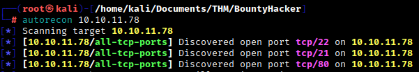
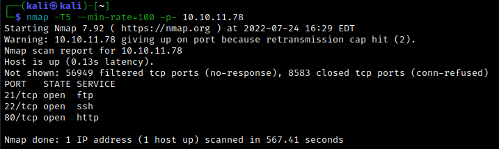
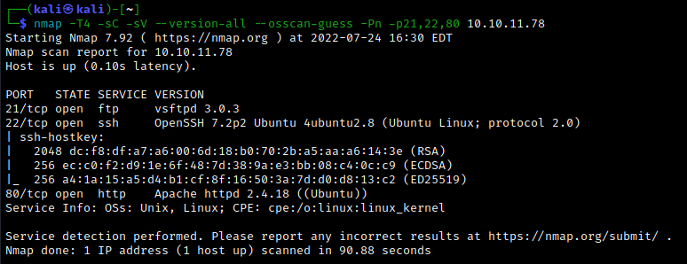
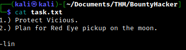
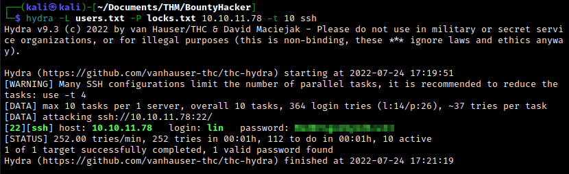
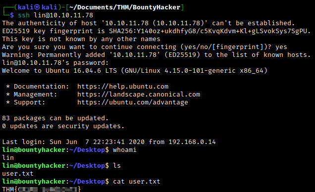
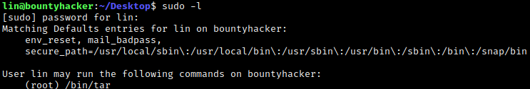
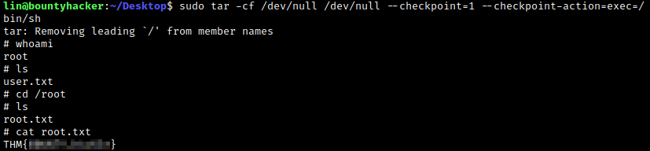

# Enumeration

We begin with an autorecon scan, followed by a couple of nmap scans for confirmation and more details.







We find ports 21, 22 and 80 are open. Taking a look at the web server, we find an image of a [well-known crew of bounty hunters](https://en.wikipedia.org/wiki/Cowboy_Bebop) together with a transcript of a conversation. A directory scan reveals nothing of note, so let's investigate ftp instead. Access the ftp server with `ftp 10.10.11.78`. There we can find two files: `task.txt` and `locks.txt`. Let's transfer them over to the local system with `get` and read them. The aptly-named tasks file gives a brief list of tasks.



Meanwhile, the locks file contains a list of (presumably) passwords, which we might be able to use to ssh into the machine.

```txt
rEddrAGON
ReDdr4g0nSynd!cat3
Dr@gOn$yn9icat3
R3DDr46ONSYndIC@Te
ReddRA60N
R3dDrag0nSynd1c4te
dRa6oN5YNDiCATE
ReDDR4g0n5ynDIc4te
R3Dr4gOn2044
RedDr4gonSynd1cat3
R3dDRaG0Nsynd1c@T3
Synd1c4teDr@g0n
reddRAg0N
REddRaG0N5yNdIc47e
Dra6oN$yndIC@t3
4L1mi6H71StHeB357
rEDdragOn$ynd1c473
DrAgoN5ynD1cATE
ReDdrag0n$ynd1cate
```

<br>

# Exploitation

Let's create file containing the seven possible usernames we've encountered: the user who wrote the note (which is probably the correct username, given that we found both files above in the same location) plus the six people mentioned on the web page. We'll call this `users.txt`. Now run hydra with `hydra -L users.txt -P locks.txt 10.10.11.78 -t 10 ssh` to brute force the ssh login. Eventually, we find the correct pair of credentials.



Now that we have a pair of ssh credentials, we get initial access to the machine. From here, we easily find the user.txt flag.



<br>

# Post-exploitation

Let's use `sudo -l` to see what our user is allowed to run with sudo privileges.



Heading over to [GTFOBins](https://gtfobins.github.io/gtfobins/tar/#sudo), we find a quick exploit which we can use to spawn a root shell. Simply run `sudo tar -cf /dev/null /dev/null --checkpoint=1 --checkpoint-action=exec=/bin/sh`, and we're done!

