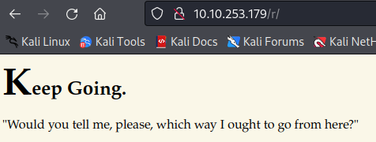
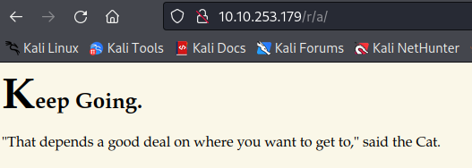

# Enumeration
We beginning by scanning for open ports. Autorecon tells us that onlyports 22 and 80 are open.

We use an nmap scan to confirm, then follow up with a detailed scan.


Let's take a look at the web server.


Enumerating the directories with gobuster gives us a few options.

```bash
gobuster dir -u http://10.10.253.179 -w /usr/share/dirb/wordlists/common.txt -x html,php,txt,jpg,jpeg,png
```


(**Note**: If we take a look at the autorecon scan results, we see that feroxbuster caught another directory: the `/poem` directory. Navigating here displays (as you might expect) a poem, but nothing else. Gobuster didn't find any subdirectories.)

The  `/img` directory contains three images.


We'll download them and analyze them using some [steganography tools](https://0xrick.github.io/lists/stego/). Using stegseek, we find a hint within one of the image files. We can also use steghide with an empty password.


We also found a directory titled `/r`. 



Let's follow the page's advice and look for further subdirectories. Eventually we find `/a`.




You can probably see where this is going. Repeating the gobuster search using our newly-found subdirectory, we eventually find:


The last page also includes the `alice_door.png` we found earlier. Another gobuster scan relative to the `/r/a/b/b/i/t` subdirectory reveals that there are no more subdirectories to find here. Taking a look at the source code reveals what appear to be credentials. The only other service we have to work with is ssh, so let's try that there.


Success!
<br>

# Exploitation
Now that we have initial access to the machine now, let's take a look around. We see a `root.txt` file immediately, but unfortunately we don't have access.


Let's use `sudo -l` to see if Alice can run anything as sudo.


We see that Alice can execute the python script in her home directory using the rabbit's privileges. This will be relevant later when we try to escalate privileges. For now, we still need the user flag.

At this point, we realize that it is somewhat strange that the root flag is contained in the user directory (since, typically, the root flag is in the root directory). Following the hint and making a guess, we use `cat /root/user.txt`, and it works!


<br>

# Post-Exploitation
Running through standard Linux playbook, we eventually find that our current user has some capabilities set. We can check this with `getcap -r / 2>/dev/null`.


We can also use [LinPEAS](https://github.com/carlospolop/PEASS-ng/releases/tag/20220717) to highlight potential privesc methods. Among many other things, LinPEAS gives us a list of files with capabilities.


Checking [GTFOBins](https://gtfobins.github.io/gtfobins/perl/#capabilities), we see that there is a way to exploit this to escalate privileges. However, Alice doesn't seem to have permission to run perl. We'll keep this in mind for later.

Going back to Alice's home directory, note that there is also a python script. Running it produces a random list of lines from a poem which can be found in the python script.


Using `ls -l` , we see that we can't write to the python script. But, if we look at the script we see it begins by importing the `random` library.


So let's try creating our own `random.py` script; by placing it in our home directory, we can force the python script to spawn a shell with root privileges. Our `random.py` will look like:

```py
import os

os.system("/bin/bash")
```

Using `sudo -u rabbit /usr/bin/python3.6 /home/alice/walrus_and_the_carpenter.py`, we can run python3.6 (applied to the python script in Alice's home directory) as the rabbit. This spawns a shell with the rabbit's privileges.


Checking the rabbit's home directory, we find a file called `teaParty`. Running it gives us a message.


The date printed is precisely one hour after the current time. Running the file again verifies this. So, it seems like the `teaParty` binary is making use of the `date` command. Printing out its content verifies this.
 


We can make use of this by altering the `$PATH` variable and creating our own script called `date`. In this way, when `teaParty` runs it will run our `date` script first. To do this, we add a path to the rabbit's home directory as follows.


Our `date` script will look like:

```txt
#!/bin/bash
/bin/bash
```

Using `chmod +x date`, we make the file executable. Now running `teaParty` gives us a shell as the hatter.


Within the hatter's home directory, we find a `password.txt` file.


We can verify that this is the hatter's ssh password. Using this, we can run `sudo -l` to see if the hatter can run anything with sudo privileges.


Nothing. However, recall that we discovered earlier that perl has capabilities set. Before we couldn't make use of this since we didn't have permission to run perl. Going back to the `/usr/bin` directory, we see that the hatter can execute perl.


So, now we can actually make use of the exploit we found on GTFOBins. For this to work, we simply run the following command from within the `/usr/bin` directory. Furthermore, we need to spawn a full shell as the hatter, otherwise we can't run perl. This is why we needed the hatter's ssh password.

After ssh'ing into hatter's account and navigating to `/usr/bin`, we simply run the following command.

`./perl -e 'use POSIX qw(setuid); POSIX::setuid(0); exec "/bin/sh";'`


Success! We have a root shell. Since we already know where the `root.txt` flag is, we just `cat` it and we're done!